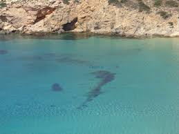
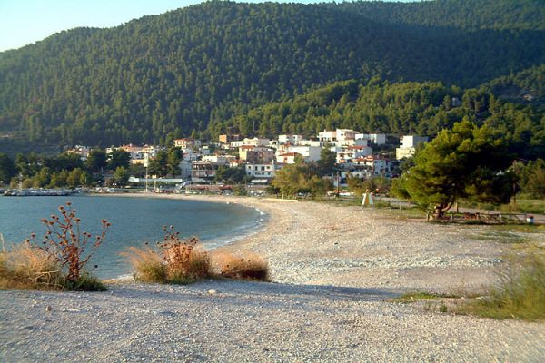
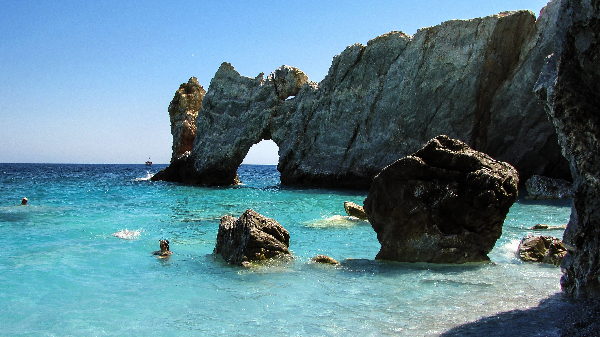
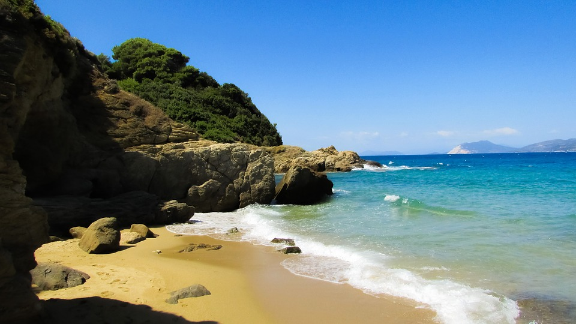

# Greek Islands

This guide provides people who would like to visit a Greek island with tips regarding food, entertainment, places to visit etc.

><b>Work tip</b>: Stand up. Stretch. Take a walk. Go to the airport. Get on a plane. Go to a <b>Greek Island</b>. Never return. </i>

## Menu
* [Greek Cheat Sheet](#greek)
* [Ionian Islands](#ionian_islands)
  * [Cephalonia](#cephalonia)
  * [Leukada](#leukada)
  * [Paxoi](#paxoi)
  * [Corfu (Kerkyra)](#corfu)
  * [Kythira](#kythira)
  * [Ithaca](#ithaca)
  * [Zakynthos](#zakynthos)
* [Cyclades](#cyclades)
  * [Santorini](#santorini)
  * [Ios](#ios)
  * [Mykonos](#mykonos)
  * [Paros](#paros)
  * [Antiparos](#antiparos)
  * [Naxos](#naxos)
  * [Syros](#syros)
  * [Amorgos](#amorgos)
  * [Sifnos](#Sifnos)
  * [Kythnos](#kythnos)
  * [Milos](#milos)
  * [Donousa](#donousa)
  * [Andros](#andros)
  * [Serifos](#serifos)
  * [Folegandros](#folegandros)
  * [Kimolos](#kimolos)
* [Sporades](#sporades)
  * [Skopelos](#skopelos)
  * [Alonnisos](#alonnisos)
  * [Skiathos](#skiathos)
* [Dodecanese](#dodecanese)
  * [Symi](#symi)
  * [Leros](#leros)
  * [Halki](#halki)
  * [Astypalaia](#astypalaia)
  * [Nisiros](#nisiros)
  * [Rhodes](#rhodes)
  * [Tilos](#tilos)
  * [Kastellorizo](#kastellorizo)
  * [Kalymnos](#kalymnos)
* [North Aegean Sea](#northAegean)
  * [Thasos](#thasos)
* [North-East Aegean Islands](#north_east_aegean_islands)
  * [Ikaria](#ikaria)
  * [Lesvos](#lesvos)
* [Saronic Gulf](#saronic)
  * [Aegina](#aegina)
  * [Spetses](#spetses)
  * [Hydra](#hydra)
* [Evia](#evia_island)
* [Crete](#crete_island)

## Greek Cheat Sheet
_Want to get the whole experience visiting one of the greek islands and feel like a true greek?(maybe even a greek god/ess) Here are some of the basic greek you can use anytime to make you feel at home._

| English        | Greek      |
|----------------|------------|
| Hello!         | Ya su!     |
| How are you?   | Ti kanis?  |
| Good!          | Kala!      |
| Good morning   | Kalimera   |
| My name is ... | Me lene ...|
| Cheers!        | Ya mas!    |
| Thank you      | Efharisto  |
| You are welcome| Parakalo   |
| I love you     | S'agapo    |

## Ionian Islands

### Cephalonia
* [Some History](#info_cephalonia)
* [Where to eat](#food_cephalonia)
* [Beaches](#beaches_cephalonia)
* [Entertainment](#entertainment_cephalonia)

#### Some History

Cephalonia is the largest of the Ionian Islands. The sapphire waters of Cephalonia are steeped with history. Cephalonia is considered by many the home to Odysseus, the legendary king hailed in Homer’s The Odyssey. Fortunately, it won’t take you ten years to get there. Explore the enchanting caverns of the Drogarati caves, sail to Ithaca on a glass-bottomed boat or marvel at the ancient artifacts inside the Archaeological Museum of Argostoli, Cephalonia’s main town. Or just hide from it all at one of the island’s many private beach coves.

#### Where to eat
* [Old Plaka](http://paliaplaka.gr/)
* [Tassia Restaurant](http://www.tassia.gr/)
* [Ladokolla stin Plagia](https://www.tripadvisor.com/Restaurant_Review-g651972-d7063210-Reviews-Ladokolla_stin_Plagia-Lixouri_Cephalonia_Ionian_Islands.html)

#### Beaches
* [Myrtos](https://www.greeka.com/ionian/kefalonia/kefalonia-beaches/kefalonia-myrtos.htm)
* [Antisamos](https://www.greeka.com/ionian/kefalonia/kefalonia-beaches/kefalonia-antisamos.htm)
* [Makris Gialos](https://www.greeka.com/ionian/kefalonia/kefalonia-beaches/kefalonia-makris_gialos.htm)
* [Skala Beach](https://www.greeka.com/ionian/kefalonia/kefalonia-beaches/kefalonia-skala_beach.htm)
* [Lourdas](https://www.greeka.com/ionian/kefalonia/kefalonia-beaches/kefalonia-lourdas.htm)
* [Foki Fiskardo](https://www.greeka.com/ionian/kefalonia/kefalonia-beaches/kefalonia-foki_fiskardo.htm)

#### Entertainment
* [Gymland](https://www.facebook.com/Gymland-413803865346952/)
* [Captain Vangelis Cruises](https://kefalonia-cruises.gr/)
* [Bee's Knees The Bar](http://beeskneesthebar.com/)
* [Costa Costa Beach Bar](https://www.facebook.com/costacostakefalonia/)

### Lefkada
* [Pack your bags](#pack)
* [Mom's spagetti](#hungry)
* [Beaches](#lefkada_beaches)
* [Happy Hour](#happy_hour)

#### Pack your bags
What if I tell you that there is a place in Leukada from which you can see earth's curvature. (take that Flat Earth Society! :earth_asia:)

It's simple. Grab your +1 😻, get in the car (yes you can drive to the island) and start the most exciting experience of your life.

#### Mom's spagetti
* [O Molos](https://www.facebook.com/omolos.lefkada/?ref=bookmarks&utm_source=tripadvisor&utm_medium=referral) (try "mom's spaggeti" from the menu! 🍝)
* [T'aloni](http://www.t-aloni.gr/?utm_source=tripadvisor&utm_medium=referral) (wonderful view)

#### Beaches

* [Porto Katsiki](https://www.tripadvisor.com/Attraction_Review-g189460-d1230867-Reviews-Porto_Katsiki-Lefkada_Ionian_Islands.html):
_The most famous beach of Lefkada._

* [Egremni](https://www.tripadvisor.com/Attraction_Review-g189460-d2225641-Reviews-Egremni_Beach-Lefkada_Ionian_Islands.html):
_One of the 13 places with the bluest water in the world among Maldives and Palawan._

* [Megali Petra](https://www.tripadvisor.com/Attraction_Review-g189460-d12803262-Reviews-Megali_Petra_Beach-Lefkada_Ionian_Islands.html):
_In translation "Big Rock" getting its name from the rocks scattered around the beach and the bottom of the sea._

#### Happy Hour
"From ancient times man wanted to fly like a bird and see the world from above." We have all heard stories like Icarus with the feathered sandals of Hermes.

Now it's your time! ✈️ 600m above ground and with a breathtaking view, it is a one-time experience.

### Paxoi
* [Discover Paxoi](#paxoiInfo)
* [Antipaxoi](#antipaxoi)
* [Where to swim](#swimPaxoi)
* [Where to eat](#foodPaxoi)

#### Discover Paxoi
How about visiting the island that was first mentioned by the greatest of ancient Greek epic poets, Homer? Paxoi in Greek is actually in plural, due to the existence of an island chain including Antipaxoi (MUST visit!) which is located 5.5 miles far away from Paxoi. The central port of Paxoi is called Gaios, where you can find plenty of restaurants and cafeterias and enjoy the beautiful view.

Are you wondering how to get there? Every day, the ferry-boats of Igoumenitsa transfer a lot of tourists who aim to explore Paxoi. If you go to Igoumenitsa by car, bare in mind that you' d better use the new highway in order to "gain" time (2 hours). Unless you want to drive for 5 1/2 hours:frowning:!

  
Ticket Information

  
Adults: 11€
     Children (over 4 ears-old): 5,50€
     Car: 42,30€
     Motorcycle: (lower than 250cc) 9€, (over 250cc) 12,80€
  

#### Antipaxoi
**How to get to Antipaxoi?**: The easiest way to get to Antipaxoi is take a small boat :boat: from Gaios. The departure point of these boats is very easy to find-you just need to take a walk around Gaios! The first stop after you take the boat is an amazing beach you can see below :ocean:. If you are a fan of camping you can also try it in Antipaxoi.

**What else to see in Antipaxoi?**: After you finish your relaxing time at the beautiful beach of Antipaxoi you can retake the same small boat and visit the wonderful caves that are located in different spots around the island but are accessible only by boat. By the way, you can rent your own boat!

#### Where to swim
Excpet for the beaches you can reach by boat, in order to reach the most remarkable ones (of course, all beaches are beautiful) you need to take the car or use the local means of transport. Here are some of the most beautiful beaches you can find in Paxoi and Antipaxoi:

* [Vrika Beach](https://www.tripadvisor.com.gr/Attraction_Review-g189461-d2061955-Reviews-Vrika_Beach-Paxos_Ionian_Islands.html):
One of the most beautiful beaches which is located in the north part of Antipaxoi is called Vrika Beach. The light-blue and green water can be easily visible when approaching the beach with the boat. The almost white sand in combination with the landscape and the clear sea will impress you. It is a well-organized beach where you can rent an umbrella and/or sunbeds and enjoy the hot summer days.
* [Monodendri Beach](https://www.tripadvisor.com.gr/Attraction_Review-g189461-d7071058-Reviews-Monodendri_Beach-Paxos_Ionian_Islands.html):
If you are looking for a non-organized beach, Monodendri is your solution. Though unorganized, you can lay on the sand, swim safely and at 7 p.m. you can enjoy the wonderful sunset. At a glance you may face some difficulties on accessing Monodendri Beach, but in reality it is not that difficult and it is absolutely worth making an effort to reach this beach.

#### Where to eat
In order to get in real touch with the atmosphere of an island you need to taste the greek traditional food with a view to the sea during the sunset. Here is a list of restos you can find in the most beautiful spots of the island:

* [La Conchiglia](https://www.tripadvisor.co.za/Restaurant_Review-g776011-d10449525-Reviews-La_Conchiglia-Loggos_Paxos_Ionian_Islands.html):
It is a high-quality restaurant where you can try fresh seafood almost at the edge of the waves. You can also find most of the traditional greek dishes except for the seafood ones. It is necessary to mention that the products that the chefs use in La Conchiglia originate from the local trade, while the oil is produced by the restaurant's owner. Of course, you can call and make a reservation a few days ahead in order to make sure that you will enjoy your meal without waiting. For more contact info, please visit the link.

* [Akis Fish Bar Restaurant](https://www.tripadvisor.com/Restaurant_Review-g1402870-d1860390-Reviews-Akis_Fish_Bar_Restaurant-Lakka_Paxos_Ionian_Islands.html):
Akis Fish Bar & Restaurant located at the edge of the harbor of Lakka, is one of the best restaurants you will find on the island of Paxos. The courtyrad of the restaurant is basically the end of the harbor of Lakka, so we can say that cannot get any closer to the sea. Not to mention the view of the incredible coastline of Lakka, which offers one the most beautiful sunsets you will ever see. But we didn't mention anything about food! For people looking to eat lunch or dinner, the restaurant offers a quality range of choices containing mainly seafood. There is also a mediterranian menu, for the lovers of the mediterranian gastronomy. Central role to this, play the fresh seafood. Various meats are also offered to complete the menu.

* [La Vista](https://www.tripadvisor.co.za/Restaurant_Review-g1402868-d12550993-Reviews-La_Vista-Gaios_Paxos_Ionian_Islands.html):
You want a restaurant where you will find a very different concept from the conventional perception prevailing in the other restaurants? La Vista is your solution! The La Vista is a new restaurant, run by young people, who have more than a decade of work experince, making them knowledgable and good at what they do. At La Vist having ordered just someof their appetisers and salads you can have a great time and leave full and satisfied, without spending an arm and a leg in comparison with a lot of restos around in the island. The La Vista serves mainly seafood, while everyday there are different homemade "mum's" dishes (moussaka, lasagne, briam).

### Corfu (Kerkyra)
* [History/Why Corfu?](#info_corfu)
* [Beaches](#beaches_corfu)
* [Foods you need to try](#foods_corfu)
* [Nightlife](#nightlife_corfu)
* [Attractions](#attractions_corfu)
* [When to visit?](#visitcorfu)

#### History/Why Corfu?
Corfu is the second largest of the ionian islands. It has been a part of greek mythology many times but now it is mostly known for its aged venetian architecture. The name Kerkyra is a modern version but it is only used in Greece. Now why visit Corfu? Well if you are not intrigued by an island that has amazing beaches, mountains to climb, lush vegetation to give you all the green you want to see, traditions and nice cuisine then at least visit it to see a landmark protected by [UNESCO](https://whc.unesco.org/en/list/978)

source: [google images](https://www.google.com/search?q=corfu+by+night&source=lnms&tbm=isch&sa=X&ved=0ahUKEwiZiPunwdrgAhUG26QKHT0yDKsQ_AUIDigB&biw=1440&bih=611#imgrc=D3wHl2CoGH5xPM)

#### Beaches :shell:
* [Porto Timoni](https://www.tripadvisor.com/Attraction_Review-g5485027-d8115796-Reviews-Porto_Timoni_Beach-Afionas_Corfu_Ionian_Islands.html):After going down a mountain for about half an hour (which of course you will have to climb back up at the end but i promise you it is totally worth it) you will find yourself in the middle of two sand beaches. Now you might be wondering:thought_balloon: what does this mean exactly? Well it means that in just a few steps you can go from one beach to another. The view from above where you can actually see that it is two different parts, because once you are down due to the dense vegetation you cannot really see it, is mesmerizing. Nevertheless the feeling of just being there is unique.

source: [google images](https://www.google.com/imgres?imgurl=https%3A%2F%2Fwww.ferriesingreece.com%2Fphotos%2Fdestinations%2Fmilos-gallery-1-1920.jpg&imgrefurl=https%3A%2F%2Fwww.ferriesingreece.com%2Fdestinations%2Fferry-to-milos%2F&docid=S7UkJ9pGosIWFM&tbnid=kNq6ykqZkOTxbM%3A&vet=10ahUKEwj9s8Kxn9rgAhUMlhQKHVihA9oQMwhvKAUwBQ..i&w=1920&h=1280&bih=623&biw=1439&q=milos&ved=0ahUKEwj9s8Kxn9rgAhUMlhQKHVihA9oQMwhvKAUwBQ&iact=mrc&uact=8)
* [Pazuzu](https://www.tripadvisor.com/Restaurant_Review-g2667806-d8421341-Reviews-Pazuzu-Glyfada_Corfu_Ionian_Islands.html): A really nice organised beach with both a beautiful scenery and a very well designed beach bar called Pazuzu offers all the amenities from the comfortable sunbeams and beanbags to the amazing parties organised on the weekends and often during the week with popular artists.

* [Cape Drastis & Canal D'Amour](https://www.tripadvisor.com/Attraction_Review-g1187633-d12619113-Reviews-Cape_Drastis-Peroulades_Corfu_Ionian_Islands.html): Corfu also has an abundance of natural clay especially in this beach. It is located in the northernmost part of the island and it consists of magnificent formations of the ground which in many cases is clay creating a beautiful landscape that does not lack in green either. The road is a bit difficult so you will need a jeep or you can just walk down and arrive in a small beach where you can either enjoy the sun and do a spa with natural clay mask you can just pick up from the ground or the rocks or take a boat to the famous [Canal D'Amour](https://www.tripadvisor.com/Attraction_Review-g676295-d2469814-Reviews-Canal_D_Amour-Sidari_Corfu_Ionian_Islands.html):heart: so you can enjoy the view on the way and possibly fall in love:heart_eyes: with the person you will swim with as the legend says.

<b>Canal D'amour:heart:</b>

source: [google images](https://www.google.com/search?q=canal+damour&tbm=isch&tbs=rimg:CcRo6ej5a2lPIjhdtCTSL0ekbhBARwUGBZ4cnw3ai-4Ngze4H9uleHdlASwlPvIEUOTQ3TUkKm3_1AWb_1L9Fakw9jwCoSCV20JNIvR6RuEUAA0MjH05xjKhIJEEBHBQYFnhwRhyxv2tFM3pEqEgmfDdqL7g2DNxFhB68ASl8BBioSCbgf26V4d2UBEZ5tPtcfJIeoKhIJLCU-8gRQ5NARkwVlP11HoO8qEgndNSQqbf8BZhHit2sCUc4u6ioSCf8v0VqTD2PAEX1xIxckc8An&tbo=u&sa=X&ved=2ahUKEwi_oaTrxdrgAhXQaFAKHSrHBYkQ9C96BAgBEBs&biw=1439&bih=623&dpr=2#imgrc=kqCpTyr37VL9SM:)

#### Foods you need to try :yum:

* [Bourdeto](https://en.wikipedia.org/wiki/Bourdeto) :stew:: _Without a doubt Corfu as an island bases a lot of its recipes on fish. Bourdeto is a fish soup with some special spices and red sauce_
* [Kumquat](https://en.wikipedia.org/wiki/Kumquat) :tangerine:: _Corfu is one of two places in Europe where you can find Kumquat a kind of tangerine. In most cases you will find it as a liqueur almost everywhere especially in the touristic part of the town and in many different flavours_
* [Tsitsibira](https://greencorfu.com/tsitsibira-the-ginger-beer-of-corfu/): _A very refreshing beverage with a unique taste made from fresh lemon juice, water, sugar and ginger_
* [Nouboulo](https://en.wikipedia.org/wiki/Noumboulo): _Also called the corfiot prosciutto, it is pork marinated in red wine, seasoned and smocked with aromatic plants_
* [Pastitsada](https://en.wikipedia.org/wiki/Pastitsada): _A dish made with rooster, octopus, veel or beef and macaroni in a red spicy sauce_
* [Greek Salad](https://en.wikipedia.org/wiki/Greek_salad): _Greek Salad is a well known greek starter and a part of the mediterranean diet_
* [Souvlaki](https://en.wikipedia.org/wiki/Souvlaki): _Probably the most popular and widely known greek food. If you know the slightest thing about Greece then you've heard of it already but have you ever tried one?_

#### Nightlife
* [54](https://www.tripadvisor.com/Attraction_Review-g662629-d10796223-Reviews-54_Dreamy_Nights-Corfu_Town_Corfu_Ionian_Islands.html): One of the biggest and for sure the most popular club in Corfu .It is also the home of a video clip to a greek song that became very popular and was played in almost every club. More detailed information can be found on their [website](http://54dreamynights.com/).

* [Barocco Beach Bar](https://www.tripadvisor.com/Attraction_Review-g1073595-d6988087-Reviews-Barocco_Beach_Bar-Messonghi_Corfu_Ionian_Islands.html): If you want a quieter night out maybe to get to know some new friends you can visit this bar placed right in front of the sea and enjoy your cocktails:cocktail: in comfy sofas, sunbeds or hammocks

* <b>Kavos</b>: If you are in a mood to party hard:dancer::wine_glass: with no control Kavos:tada: is the place for you. It is at the bottom of corfu where on the main streets are filled with bars and clubs right next to each other and usually the party goes from club to club as well as on the street.Each one has a different setting and a different theme party most of the times. They usually begin at noon and keep on going until early in the morning. It is especially popular among British people.

#### Attractions
* [Olive Oil Tasting](http://thegovernor.gr/): There are over 4 million olive trees on Corfu Island and although a lot of greek people are lazy and decide not to do much with the olives there are a few that work to produce olive oil and it is of amazing quality. Furthermore olive oil has always been a big part of greek diet, traditions and history. The governor is one of the few that also offer organised olive oil tasting tours.

* [Aqualand](https://www.tripadvisor.com/Attraction_Review-g1574356-d664631-Reviews-Aqualand-Agios_Ioannis_Corfu_Ionian_Islands.html): Aqualand is a very popular and big water park hosting over 38 slides for both kids and adults and of course for our friends the adrenaline junkies. It also has a wave pool, a lazy river where you can relax in between rides, several splash zones, a wet and a dry bar, and other activities. Information about prices will be available on their [website](https://aqualand-corfu.com/) as soon as they reopen for the season.

* [Corfu Old Town](https://www.tripadvisor.com/Attraction_Review-g662629-d8498696-Reviews-Corfu_Old_Town-Corfu_Town_Corfu_Ionian_Islands.html): At some point of your trip you will have to visit the old town. There you can find the <b>old and</b> the <b>new fortress</b>, the <b>church :church: of [Saint Spyridon](https://en.wikipedia.org/wiki/Saint_Spyridon)</b> who is believed to have saved the island at the second great siege. He is loved and celebrated by all locals and you will notice that the name Spyridon is very popular among them. In the old venetian fortress you can find <b>Saint George church</b> :church:. Coming out of the fortress and to your right you can find the <b>[Spianada Square](https://www.tripadvisor.com/Attraction_Review-g662629-d196346-Reviews-Spianada_Square-Corfu_Town_Corfu_Ionian_Islands.html)</b>. Now walking towards the town before you enter you will see a big road only for pedestrians. This is the famous <b>[Liston](https://www.corfuhistory.eu/?p=2508)</b> a place where you can get a nice cup of coffee:coffee: relax and enjoy the fantastic view of the green park and fortress on one side and the first line of buildings on the other side.

<b>Liston</b>

source: [google images](https://www.google.com/imgres?imgurl=http%3A%2F%2Fsotiriaparamonas.gr%2Fwp-content%2Fuploads%2F2016%2F04%2Fbg-liston.jpg&imgrefurl=http%3A%2F%2Fsotiriaparamonas.gr%2Findex.php%2Fold-town%2F&docid=OwRfHCltFBdYYM&tbnid=biqGo7zl_fyokM%3A&vet=12ahUKEwja1unqv9rgAhUINOwKHetSBEo4ZBAzKBAwEHoECAEQEQ..i&w=1382&h=727&bih=611&biw=1439&q=kantounia&ved=2ahUKEwja1unqv9rgAhUINOwKHetSBEo4ZBAzKBAwEHoECAEQEQ&iact=mrc&uact=8)

<b>Kantounia</b>

source: [google images](https://www.google.com/imgres?imgurl=https%3A%2F%2Fi2.prth.gr%2Ffiles%2F2013%2F08%2F09%2Fkantouniaa.jpg&imgrefurl=https%3A%2F%2Fwww.protothema.gr%2Ftravelling%2Farticle%2F301463%2Fkerkura-i-komissa-tou-ioniou%2F&docid=09ZqAjZxqQwnqM&tbnid=3pNvNaUnds9jTM%3A&vet=10ahUKEwiZ0eLAwNrgAhWHMewKHYCKB_oQMwhJKAswCw..i&w=620&h=386&bih=611&biw=1440&q=kantounia&ved=0ahUKEwiZ0eLAwNrgAhWHMewKHYCKB_oQMwhJKAswCw&iact=mrc&uact=8)

* [Vlacherna Monastery & Mouse Island](https://www.tripadvisor.com/Attraction_Review-g189458-d6979708-Reviews-Vlacherna_Monastery-Corfu_Ionian_Islands.html): The most iconic site of Corfu. This monastery has its own island in which you can get to through a road over the water. Interesting enough if you stand on the road for a bit during flights rush hour you can get some amazing shots:camera: where you can pretend that you are touching the :airplane: since the airport is right next to the water so at this point the planes are flying low. From there you can also get a small boat and visit mouse island (Pontikonissi), which is said to be the ship that brought the king of Ithaca and the hero of Odyssey to the island of the Phaeacians that washed out on the shore and god later on turned it into this beautiful small green rock.

source: [google images](https://www.google.com/search?q=vlacherna+monastery&source=lnms&tbm=isch&sa=X&ved=0ahUKEwii8dz3v9rgAhWIJVAKHbYBDdcQ_AUIDigB&biw=1439&bih=611#imgrc=KtydXl-X0iw7OM)

* [Achilleion](https://www.tripadvisor.com/Restaurant_Review-g662629-d1097320-Reviews-Achilleion-Corfu_Town_Corfu_Ionian_Islands.html): A palace built as a home for the Austrian Royalty Elisabeth of Bavaria also known as princess Sisi. Corfu was Sisis favourite vacation place so she wanted the palace to be as beautiful as her thoughts for the island. As a result the palace is stunning on the inside as well as on the outside with huge gardens filled with flowers and statues inspired from greek mythology.

source: [google images](https://www.google.com/search?biw=1440&bih=611&tbm=isch&sa=1&ei=Z8R1XKy5IMf8kwXV3JbYCQ&q=achilleion+inside&oq=achillei&gs_l=img.1.1.35i39l2j0l8.350115.352034..353665...0.0..0.107.752.6j2......1....1..gws-wiz-img.XcHRWCtINcM#imgrc=HFtiHoz0GbfqBM)

#### When to visit?
If not in the summer when it is best for almost all islands then i would recommend Orthodox Easter time. Corfu has some unique traditions that make it a very popular destination around this time so be prepared for a big crowd but it's worth it.Two of the rituals that stand out are Good Friday
when the epitaph processions which have different colours depeding on the church come out all intersect at the centre of town and Holy Saturday
when suddenly the mood changes within a few minutes from the mourning of the epitaph to the joy of the first Easter which here happens at 11:00 a.m in the morning of Saturday.Locals throw in the streets large clay pitchers filled with water from every balcony of the island while the church bells peal joyfully. After that the three marching bands come out again to parade around the town playing joyful music this time. You are not convinced yet? Make sure to check out the video below.

<b>Youtube video: Easter in Corfu</b>

source: Ani Skevi

### Kythira

(www.kythera.gr)
* [Is that an island](#infokyth)
* [Astonishing Beaches](#beacheskyth)
* [Breathtaking Views](#viewskyth)
* [Great nature](#naturekyth)
* [So, why kythira](#whykyth)
* [Tips from a local](#tips_kyth)

#### Well it is...
And it's beautiful. It is located under Pelopponese and the combination of the 3 open seas around it and the various influences from a wide variety of civilizations occupying it through the centuries ,has created a unique scenery. The island was a crossroad for merchants since the ancient times and also a fortress during wars due to its significant strategic position. The result of that reflects on the island's architecture, traditions and customs. Beside it's diversity, Kythira is also believed to be the island of Aphrodite,an ancient godess-protector of pure love. Due to that, during the modern days the island is believed to have an ability to create and maintain pure forever-lasting relationships for its occupants and visitors ,which is also the reason why many couples visit the island annually.:heart:

#### For every taste
The island offers a wide variety of unique majestic beaches numbering more than 100. A high percentage of them is also honored with the [Blue Flag](http://www.blueflag.global/)

(www.kythera.gr)

#### Views you need to see
During sunset the siland hills provide a majestic view to the Aegean or the Ionian sea which no one should miss.(Not recommendable if you feel a bit tipsy :cold_sweat:)

#### A Tropical nature
During Summer if you feel like you need some place to chill under a tree after a long day in the sun ,there is a location on the island called Mylopotamos where you can see a while different scenery.You can find waterfallls and small lakes and you could also take the small path to the old watermills. A true majestic scenery :open_mouth:

(www.kythera.gr)

####  If you're not sure yet:
Kythira can provide any traveller a whole different experience, it's culture is so different from any other island and the locals are so friendly the will make you feel like you visited your grandmother's house.All the traditional food, the scenery,the beaches and even the long walks in the cliffs during sunset will make you feel like you are in heaven. At last, as the locals say "If you visit Kythira once, you will fall in love with it"!

(www.kythera.gr)

If all the above didn't convince you yet,well you should definately watch the following video from a drone :heart_eyes: [Kythira from Above](https://www.youtube.com/watch?v=pdA6xu342QA)

#### Tips from a local
Must do on the island : You need to take captain Spyros Glass Bottom boat to the small island of Hytra the only place where the local flower Sempreviva grows. There you can use captain Spyros equipment to dive into the light blue waters and if you're a bit lucky you may face sea turtles staring at you  :turtle:
Moreover don't hesitate asking the locals for traditional recipes , the will provide you with everything you need and probably also invite you for a proper kytherian dinner where you can taste the best food you can get on the island, i ensure you you will feel like you're visiting your grandmother for a weekend :whale: :stuck_out_tongue_closed_eyes:

### Ithaca
* [General Informations About the Island](#general_informations)
* [Best Beaches in Ithaca](#beaches_ithaca)
* [Best Restaurants in Ithaca](#restaurants_ithaca)
* [Best Places to Stay in Ithaca](#places_to_stay)
* [Best Parks & Nature Attractions in Ithaca](#attractions)
* [What Else...](#what_else)

#### 
 * <b>The island of Odysseus</b> :The hero's adventurous journey to his homeland of Ithaca made this island mythical, immortal. The intense alternations of the landscape, adorned with the beauties of wild and calm nature, make up a provocatively special relief. Traditional settlements, deep blue waters and many landscapes are waiting for you to visit them!!!

  * <b>About the nightlife in Ithaca island </b> : Nightlife in Ithaca is restricted to few taverns and lounge bars. The waterfronts of Vathi, Frikes and Kioni are lined up with many delicious restaurants and taverns that usually stay till a bit after midnight, creating a romantic atmosphere. Such taverns can also be found in the mountainous villages of Ithaca. Usually in the evenings, the cafeterias of Ithaca turn into lounge bars and stay open till a bit after midnight. Generally, nights in Ithaca are peaceful and romantic.

  

#### Beaches in Ithaca :

* <b>Dexa</b> : Situated 1.5 km north from Vathi, at the other side of the port, on the road to Aetos, this blue flagged beach is ideal for families with children, as it offers organized facilities.

* <b>Platia Ammos</b> : One of the best beaches on Ithaca that combines sand and wonderful pebbles as well as clear water, is accessible only by boat but you should visit it!!!

* <b>Sarakiniko</b> : A magnificent pebbly beach with rich natural beauty and crystal clear waters. Ideal for relaxation, while the trees present offer ample shade.

* <b>Filiatro</b> : The beach is the closest to Vathi, ideal for those who stay close to the city. It has crystal clear waters and is surrounded by trees that reach the sea.

* <b>Gidaki</b> : Ιf you want to cross a hilly path to find yourself on a beautiful beach with white sand and deep blue waters, then you should visit this place. You don't need any supplies, as the beach has a small canteen where you can find whatever you need.

#### Locale Cuisine :
* <b> Tsirimbis Restaurant </b> is a local tavern that exists since 1956. Without losing its traditional character it offers you the opportunity to taste traditional pies (chicken, spinach, onion, cheese pie), pasta, garlic, fish (stuffed with garlic) and bourgeois, many home-made appetizers (taramosalata, tzatziki, cheese, eggplant).

* <b> Sirens </b> is a combination of local and gourmet cuisine, where you can find pies,jams, saganaki, rabbit stiphado and other traditional foods.

* If you want to taste something sweet you can try the Hanou Patisserie that is located in the central square of the island overlooking the Odysseus statue and has been operating since 1972 with traditional recipes such as rhubanes, truffles and many tasty cakes.

#### Accomodation in Ithaca :
 * The capital and port of the  island is <b>Vathi </b>.Vathi is an ideal starting point to get to know all the sights of the island. Just 3 km south, the picturesque Perachori with the magnificent view.
 You can choose hotel or rental rooms in Vathi or Perachori such as Hotel Familia,Korina Gallery Hotel, Bay View House, Alicelia Boutique Inn and Christina Apartments, Erigonis Simiri House.  

####  The Top 3 Attractions for Nature-Lovers:  
* <b>No.1 Palaiochora-Nymphs Cave-Vathi</b> : From there begins the path that will lead you from Palaiochora to the cave where Odysseus hid the gifts of Phaeacians when he finally arrived in Ithaca.There are stone benches all over the route that offers you the chance to see the view of the bay of Ithaca and the Ionian Sea. The path passes through the buildings of the medievalk settlement of the island. From there you will go to Nymphs Cave and finally to Vathi.

* <b>No.2 Parachori-Agia Paraskevi-Dasos-Agios Gerasimos</b> : The forest of Perachori is just above the first houses of the village.Walking through the woods is quite easy and you will in your path two white chapels.The small chapel of Agia Paraskevi will appear in front of you amongst the tall trees. The panoramic views to Perachori and the Ionian Sea will take your breath away.   

* <b>No.3 Anemodouri-Arethousa Krini </b> : Before the end of the road from Vathi to Marathias there is a blue sign Arethousa Krini.  From this point begins the path leading to the water spring of the homeric references.If you are an athletic and risky type, you can go downhill to the last junction and you will reach the beach Pera Pigadi (name which refers to the water spring), where the cold waters of the Ionian Sea will compensate you for the heat!

#### What else...
* If you are an adventure lover, you can visit <b>Odyssey Diving and Sea Kayak Club</b> where you can find the right equipment for every activity. Then you can explore the bottom of the sea and some of the secret beaches.
Check it out here- https://www.youtube.com/watch?v=5oyje83lrOY

### Zakynthos
* [General Informations About the Island](#gen_info)
* [Best Beaches in Zakynthos](#beaches_zakynthos)
* [Nightlife and Party](#ent_zakynthos)

#### 
 * <b>Zákynthos (Zante)</b> is a verdant island endowed with valleys . Its landscape diversity has resulted in different types of beaches: there are sandy beaches in secluded coves where the tranquil waters are deep blue ; yet, if rugged cliffs and an interesting underwater world are to your liking, try the western part of the island.

 

#### 
 * What makes Zakynthos island unique is the magical beaches with the blue sea water, the variety of water sports available and of course the tiny isolated beaches.

 * <b>Kalamaki </b> beach is 8km away from Zakynthos town. Opposite stands the popular Cameo island accessible by a wooden bridge, that has a bar -cafe and a tiny beach with shallow, warm sea water.The restaurants and the bars situated along Kalamaki beach are open till sunset.

  

  * <b>Makris Yialos </b> is 7.5 km away from Alykes and 25km from Zakynthos town. The sea water is clear, deep and blue appropriate for scuba diving. There are tiny pebbles, a bit sand and numerous caves to be explored.Makris Yialos is perfect for couples,swimmers and nature lovers.

   

* <b>Porto Limnionas</b> is a coast with magical natural beauty
It is located next to village Agios Leon. The beach has rocks surround the coast and the sea water is deep, cool and crystal, perfect for diving. In the distance of 30m a tavern serves fresh fish and other traditional dishes.The coast is perfect for swimmers, snorkelling and scuba diving.

 

#### 
* <b>Laganas</b> is the most popular part of the island, famous for its intense nightlife. There are plenty of nightclubs along the main road. Greek music is seldom heard, since Laganas mainly hosts foreign holidaymakers. Many bars organize karaoke nights, quizzes and various other entertaining games. Many cafes show movies or sports matches on big screens. Most of them open from 18:30 in the afternoon until 4 in the morning in the weekdays and until 6 in the morning Friday and Saturday.

 

## Cyclades

### Santorini
* [General Info](#general_info_santorini)
* [Beaches](#beaches_santorini)
* [Sightseeing](#sightseeing_santorini)

#### General Info
Santorini or Thira or Stroggylh (older name) is an island located in the south of Aegean Sea, part of Cyclades. Today Santorini is one of the most famous touristic destinations worldwide. The ground is volcanious and from the side of the volcano the island is extremely rocky. Fira is the capital of the island. The most iconic things of the island is the mesmerising sunsets you can see, combined with the volcanic rocks.

#### Beaches
The volcanic nature of Santorini is what makes this place unique. All the beaches are totally different compared to the other beaches in the Aegean. The black beaches in <b>Kamari</b> and <b>Perissa</b> and the enormous beach in <b>Blychada</b> reminds of a lunar landscape. Some more famous beaches are the <b>Red Beach</b>, <b>White Beach</b>, <b>Armeni</b>, <b>Peribolos</b> and <b>Ammoudi</b>.

#### Sightseeing

* <b>Foundings of Minoan Town</b> : This archeological place is located close to the Akrotiri, south of the island. Experts have found ruins from the rich Minoan town, which was first destroyed from an earthquake and later was buried because of a destructive volcanic eruption in the 17th century B.C

* <b>Foundings of Ancient Thira in the Big Mountain</b> : This archeological place is located in the southeast side of the island and is a must-see. There you will observe some buildings from Greek and Roman period  including the temples of Artemidwforou and Dionysou, combined with ruins from other monuments like the theater , which were built between 3rd - 4th century B.C by Ptolemaious

* <b>Thermal Baths of New & Old Kameni</b>: One of the most famous places you can see in Santorini is the volcanic islands in the center of Kaldera, in which you can explore with touristic boats. There you will p climb to the volcano and swim in thermal baths.

<b>Red Beach</b>

source:https://www.google.com/search?biw=1600&bih=789&tbm=isch&sa=1&ei=Ap91XLjAAYqnUt_Ng6AP&q=red+beach+santorini&oq=red+beach+&gs_l=img.3.0.0i67j0j0i30l8.12412.13394..14699...3.0..0.171.540.0j4......1....1..gws-wiz-img.......0i19j0i8i30i19.qwJe-_fOH54#imgrc=cD_Zevd5GmNFXM:

<b>Kamari</b>

source: https://www.google.com/search?biw=1600&bih=789&tbm=isch&sa=1&ei=JKB1XObVF--NlwSh46ugDA&q=kamari+beach&oq=kamari+b&gs_l=img.3.0.35i39j0l2j0i30l7.4346.5919..6917...0.0..0.146.992.0j8......1....1..gws-wiz-img.....0..0i67j0i10.dA19nqOg0GI#imgrc=R-sG2CLq_WWfvM:

<b>Vlychada</b>

source: https://www.google.com/search?q=vlychada+beach&source=lnms&tbm=isch&sa=X&ved=0ahUKEwi1huClndrgAhWEyYUKHREsCHgQ_AUIDigB&biw=1600&bih=789#imgrc=c3I7TkOfY7hpGM:

### Ios
* [General Info](#general_info_ios)
* [Beaches](#beaches_ios)
* [Activities](#activities_ios)
* [Sightseeing](#sightseeing_ios)
* [What about the party?](#party_ios)

#### General Info
Located in Aegean between Santorini , Naxos you can find one of the most beautiful islands  of Greece. Small island which stands out with it's golden beaches and crystal clear waters.

#### Beaches
Most famous beach of Ios is Mylopotas, which is located in a very close distance from the town. More beautiful beaches are Magganari, Gyalos , Kolitsani, Koumpara, Kalamos and many more. There are also some smaller ones which is really hard to access.

<b>Mylopotas Beach</b>

source: https://www.google.com/search?q=%CE%BC%CF%85%CE%BB%CE%BF%CF%80%CE%BF%CF%84%CE%B1%CF%82&source=lnms&tbm=isch&sa=X&ved=0ahUKEwj8ysuvntrgAhUXxMQBHcTTBG8Q_AUIDigB&biw=1600&bih=789#imgrc=-Iq9ptTw5WR1uM:

<b>Magganari Beach</b>

source : https://www.google.com/search?q=%CE%BC%CE%B1%CE%B3%CE%B3%CE%B1%CE%BD%CE%B1%CF%81%CE%B9+%CE%B9%CE%BF%CF%82&source=lnms&tbm=isch&sa=X&ved=0ahUKEwiOnZm9ntrgAhUMWZoKHR9wA00Q_AUIDigB&biw=1600&bih=789#imgrc=EgDSmGotY63IGM

#### Activities
<i> In <b>Mylopotas</b> beach you can find these water sport activities </i>

[Mylopotas Water Sports](https://www.tripadvisor.com.gr/Attraction_Review-g1189855-d1453894-Reviews-Mylopotas_Watersport-Milopotas_Ios_Cyclades_South_Aegean.html)

* Windsurfing
* Wake-boarding
* Jet-ski
* Scuba-diving
* Kitesurfing (Highly Recommended)

#### Sightseeing

*  Little church of <b>Agias Eirinis</b> (17th century), it is built on the right side of the port
*  <b> Tomb of Homer </b> in Plakoto
*  <b> Ruins of byzantine fort </b> in Paliokastro
*  Area of <b> Windmills </b> (12 in number)
*  <b> Archeological Museum </b> of Ios

#### What about the party?
* [Far Out Beach Club](https://www.hostelworld.com/hosteldetails.php/Far-Out-Beach-Club/Ios/4118): One of the most crowded places in Ios, a club near the beach that offers also accommodation and a pool. The best place to party in summer you can be in your swimsuit dancing all day with great Djs on deck and get a temporary colorful "i :heart: Ios" tattoo from the body painters.

source: [farout club facebook page](https://www.facebook.com/FarOutBeachClub/)

source: [farout club facebook page](https://www.facebook.com/FarOutBeachClub/)

* [Pathos Lounge Bar and Restaurant](https://www.tripadvisor.com/Restaurant_Review-g196481-d6940378-Reviews-Pathos_Lounge_Bar_Restaurant-Ios_Cyclades_South_Aegean.html): Breathtaking view, amazing people and organised events, and unique and beautiful designs in every corner giving you memories that will last forever.

source: [pathos sunset lounge facebook page](https://www.facebook.com/pg/pathoslounge/posts/?ref=page_internal)
* [Steps](https://www.tripadvisor.com/Attraction_Review-g196481-d10458435-Reviews-Steps-Ios_Cyclades_South_Aegean.html): An alternative and more relaxed bar situated on some stairs. You can relax on the steps enjoy a chat and some drinks while sitting on pillows with a kind of a hippie vibe.

source: [Steps bar ios facebook page](https://www.facebook.com/stepsbarios/)

* [Shush Bar Ios](https://www.facebook.com/ShushBarIos/?hc_ref=ARQLVvqDqghFoyGl-dDKltcVkCsjn_KOitqYvuKBbihc0wdei3yXuGH2GMa_yLELGLI&__xts__[0]=68.ARAgdxPIVLWT6D0xNXh6nwhNxkvlNqQ3Ki1yPCkDq6mHKCDHsWHmsJriBxDwNBC9XevYwaVdaskDsUzD0m3ItpLsht6qZ9sqksI_tZH6H8boCIigKykMreV3dWCBCxphq6IUKBhSi43SYjyDpuVnKq9ymMyYrnYxfK674YtOqzQhL99zQKkYZbjC5uYB90SSdl418PVOI_VZLPQDJECVKtFh3paqBpbIcD5M-dHCmB0eIWeEZgOcnsGT1X1oRerjlok4_U__9A&__tn__=kC-R): The first and only silent:mute: disco in Ios, Greece. You are able to listen to one of the three different music channels and sync with whoever you want to dance on the same tones trough the wireless headphones provided.

### Mykonos
* [General Info](#general_info_mykonos)
* [Entertainment](#adrenaline_mykonos)
* [Food](#food_mykonos)
* [Nightlife](#nightlife_mykonos)

#### General Info
Mykonos is a Greek island, part of the Cyclades, lying between Tinos, Syros, Paros and Naxos. Mykonos's nickname is "The Island of the Winds". Tourism is a major industry and Mykonos is known for its vibrant nightlife and has many establishments catering for the LGBT community. It is considered the most famous cosmopolitan island in the world. According to mythology, Mykonos was formed from the petrified bodies of giants killed by Hercules. The island took its name from the grandson of Apollo, “Mykonos”.

#### Need an adrenaline rush?
The island is a paradise for water sport enthusiasts! It is only natural that the “Island of the Winds” should attract surfers and sailors from all over the world! There is a great choice of beaches for windsurfing; however, the most secluded ones are considered to be the best. Choose from <b>Kórfos, Fteliá, Meyáli Ámmos and Kalafátis</b>, where surfing lessons are also available. Play tennis or mini golf at <b>Ayios Stéfanos</b>, beach volleyball at <b>Ayia Anna</b> or try sea parachuting or jet skiing at <b>Eliá</b> or <b>Kalafátis</b>. Diving fans can do a little exciting exploration of the underwater magic of <b>Mykonos</b>. September is thought to be the best month for diving, as the water is warm and visibility is good down at the seabed.

#### What about food?
Don’t miss the opportunity to treat yourself to some local Aegean specialties! Pepper flavoured <b>kopanistí</b>, a soft cheese seasoned with pepper, is the island’s gastronomic trademark. Try it as a topping on a round rusk spread with grated tomato, a favourite local mezés (appetiser). Meat eaters can sample <b>“loúzes”</b> (cooked pork filet with spices) and tasty local sausages sprinkled with pepper, and local oregano that has been caressed by the sun and dried in the north wind. To finish off your meal you can sample two exceptionally good local pastries, <b>“amigdalotá”</b> (small round cakes with ground almond, rosewater and caster sugar) and <b>honey pie</b>.

#### Nightlife!
Mykonos is the top destination for the active nightlife and crazy throughout Greece: nightlife and fun, main ingredients, able to attract every year many young people from around the world. Paradise beaches, elegant nightclubs and beach bars with djs and international parties at all hours of day and night: Mykonos won rightfully the nickname “party island”, the island of the feast, and as for fun can compete with the famous Ibiza.

* [Paradise Club](http://www.paradiseclubmykonos.com/) (Paradise Beach, Mykonos)
Situated on the beach of Paradise Beach, the Paradise Club is considered as the most famous nightclub in Mykonos and assaulted daily by a thick festive throng, gathering on this beach to have a cocktail and dance or listen to House music, techno and rock, from the afternoon until the wee hours of the morning.

source:https://www.google.com/search?q=mykonos+paradise&source=lnms&tbm=isch&sa=X&ved=0ahUKEwjqy7DltNTgAhXqMewKHWowBH4Q_AUIDigB&biw=1536&bih=722#imgrc=VX0eoTiCzR2_QM

* [Tropicana Beach Bar](https://www.tropicanamykonos.com/) (Paradise beach, Mykonos)
Open daily from 9.00 to 1.00.
Located Paradise Beach, the Tropicana Beach Bar is one of the most known for partying in Mykonos, a veritable institution for its Wild beach parties which attract many young people coming from all over Europe with the sole purpose of having fun.

source:https://www.google.com/search?biw=1536&bih=674&tbm=isch&sa=1&ei=nJNyXI6QCIGRkwXy34iQCA&q=tropicana+beach+bar+mykonos&oq=tropicana+bar+m&gs_l=img.3.0.0i8i30l3.47815.57614..59014...1.0..1.213.2088.0j14j1......2....1..gws-wiz-img.....0..35i39j0j0i67j0i30j0i19j0i5i30i19j0i8i30i19j0i5i30.XIoJ3Yo1zbU#imgrc=YFyDSfjyplu8vM

* [Cavo Paradiso](https://www.cavoparadiso.gr/) (Paradise Beach, Mykonos)
Open daily from 23.30 to 7.30.
Located on a hill that overlooks Paradise Bay and with a breathtaking view of the sea, the disco Cavo Paradiso is another highlight of the Mykonos nightlife. Here the party starts around 2.00 and continues until late morning. Cavo Paradiso, In addition to being considered one of the the most beautiful clubs of Mykonos, It is certainly the most expensive: the entrance ticket can cost 30 or 40 euros.

source:https://www.google.com/search?biw=1536&bih=674&tbm=isch&sa=1&ei=2JNyXL-4IY_9kwX42pPgBg&q=cavo+paradiso&oq=cavo+p&gs_l=img.3.0.0j0i67j0l4j0i30l4.29408.30893..32005...0.0..0.203.902.0j5j1......1....1..gws-wiz-img.......35i39.XxWpoPJ7OWg#imgrc=NsbFBfk4Pok1cM:

* [Super Paradise](https://www.superparadise.com.gr/) (Super Paradise Beach, Mykonos)
Super Paradise Beach and the club are a party continues, between sea, animation, dancers and dancers, dance performances and music blaring, that focuses on Greek and international hits. But above all, lots of people having fun from morning to night.

source:https://www.google.com/search?biw=1536&bih=674&tbm=isch&sa=1&ei=-ZNyXK-dKsLekgWCobOwCQ&q=super+paradise+mykonos&oq=super+pa&gs_l=img.3.1.0l10.19793.21488..22934...0.0..0.193.1091.0j8......1....1..gws-wiz-img.......35i39j0i67.ikSIAjLwERo#imgrc=A0arKsSGwuWvDM:

* [Scandinavian Bar](http://www.skandinavianbar.com/) (Agios Ioannis Barkia, Mykonos)
Open daily from 20.00 to 6.00.
True icon of Mykonos nightlife Since 1978, lo Scandinavian Bar over the years remained one of the most beloved and popular night hangout spots on the island. A must for many young people and tourists who begin their evenings: the bar serves a variety of cocktails and great music, which ranges from dance, Rock and carefree songs.

source:https://www.google.com/search?biw=1536&bih=674&tbm=isch&sa=1&ei=EZRyXLyNMM_isAfLpLm4CQ&q=scandinavian+bar+mykonos&oq=scandinavian+bar+mykonos&gs_l=img.3..0i10i24.34102.43485..43648...1.0..0.223.3443.0j21j2......1....1..gws-wiz-img.......35i39j0i67j0j0i30j0i19j0i30i19j0i8i30i19.7DL2G0Ovt4I#imgrc=zIz7Ws0IwEI7nM:

### Antiparos
* [Some History](#info_antiparos)
* [Where to eat](#food_antiparos)
* [Beaches](#beaches_antiparos)
* [Entertainment](#entertainment_antiparos)

#### Some History

Antiparos is a small island of Cyclades, located just next to Paros island. Antiparos is a nice destination for one day excursion from Paros. Nudism and camping are particularly popular on these beaches. Chora, the capital and only village of Antiparos Greece, has traditional Cycladic architecture with narrow paved streets, whitewashed houses and lovely blue-domed churches. On the southern side, there is an impressive cave with stalactites and stalagmites.

#### Where to eat
* [Kalokeri](https://www.tripadvisor.com/Restaurant_Review-g3569526-d10445320-Reviews-Kalokeri-Antiparos_Town_Antiparos_Cyclades_South_Aegean.html)
* [Pavlos Place](https://www.tripadvisor.com/Restaurant_Review-g189425-d3222333-Reviews-Pavlos_Place-Antiparos_Cyclades_South_Aegean.html)
* [Argo Restaurant](https://www.tripadvisor.com/Restaurant_Review-g189425-d2307690-Reviews-Argo_Restaurant-Antiparos_Cyclades_South_Aegean.html)
* [Vicky's Ice Cream](http://www.vickys.gr/): Best Ice cream in town --> Highly recommended

#### Beaches
* [Faneromeni Beach](https://www.tripadvisor.com/Attraction_Review-g189425-d7019954-Reviews-Faneromeni_Beach-Antiparos_Cyclades_South_Aegean.html)
* [Saint George Beach](https://www.tripadvisor.com/Attraction_Review-g189425-d4893887-Reviews-Saint_George_Beach-Antiparos_Cyclades_South_Aegean.html)
* [Nudist Beach](https://www.tripadvisor.com/Attraction_Review-g3569526-d7070930-Reviews-Nudist_Beach-Antiparos_Town_Antiparos_Cyclades_South_Aegean.html)
* [Soros Beach](https://www.tripadvisor.com/Attraction_Review-g189425-d8670305-Reviews-Soros_Beach-Antiparos_Cyclades_South_Aegean.html)
* [Sifneikos Gialos](https://www.tripadvisor.com/Attraction_Review-g3569526-d14966918-Reviews-Sifneikos_Gialos-Antiparos_Town_Antiparos_Cyclades_South_Aegean.html)

#### Entertainment
* [Sunset Desao](https://www.google.com/search?q=antiparos%20sunset%20beach&oq=antiparos+sun&aqs=chrome.1.69i57j0l5.4852j0j4&sourceid=chrome&ie=UTF-8&npsic=0&rflfq=1&rlha=0&rllag=37042586,25075926,126&tbm=lcl&rldimm=14111529459053696804&ved=2ahUKEwijtJuN9s3gAhVF6qQKHV71DfQQvS4wAXoECAAQHg&rldoc=1&tbs=lrf:!2m1!1e2!2m1!1e16!3sIAE,lf:1,lf_ui:2#rlfi=hd:;si:14111529459053696804;mv:!1m2!1d37.0438204!2d25.0763062!2m2!1d37.041353!2d25.075545800000004;tbs:lrf:!2m1!1e2!2m1!1e16!3sIAE,lf:1,lf_ui:2): Best Sunset View

### Naxos
* [Discover Naxos](#discover)
* [Where to swim](#swim)
* [Where to eat](#eat)
* [Where to drink](#drink)

#### Discover Naxos
Imaginary white long beaches, romantic alleys, peaceful sunsets and unforgettable nights are what Naxos island is all about.

#### Where to swim
You'll never face a problem with that. I promise!
There are so many different beaches and each of them has it's own beauty that will definitely seduce you.
Top 5: Plaka, Agios Prokopios, Agia Anna, Orkos and Mikri Vigla

#### Where to eat
Did you know that Naxos is the most fertile island of Cyclades? Then now you know.
Trust me, you will eat the most tasty potatoes!
* [Matsouna](hhttp://www.ostria.com/naxos_restaurant/?utm_source=tripadvisor&utm_medium=referral)
* [Agia Anna](https://www.facebook.com/dimitris563/?utm_source=tripadvisor&utm_medium=referral)
* [Kastraki](http://www.apolafsinaxos.gr/?utm_source=tripadvisor&utm_medium=referral)

<b>Bonus Tip:</b>
Near Hawaii beach, there is a small food truck called FBI SA, where you can find burgers, hot dogs, bao buns etc. made with traditional Naxian ingredients. It is AMAZING!

Front: The Mafia Burger with caramelized panseta with bbq sauce and arseniko cheese of Naxos  
Back: The Hula dog with chicken, caramelized pineapple, yogurt sauce and graviera of Naxos

#### Where to drink
If you like Cocktail bars next to the sea with loud music till dawn then Naxos is surely your perfect choice.
Top 3:
* [520 Bar](https://www.tripadvisor.com.gr/Attraction_Review-g580192-d6720618-Reviews-520_Bar-Naxos_Town_Naxos_Cyclades_South_Aegean.html)
* [The Ocean Club](https://www.tripadvisor.com.gr/Attraction_Review-g580192-d8332563-Reviews-The_Ocean_Club-Naxos_Town_Naxos_Cyclades_South_Aegean.html)
* [The Rum Bar Cocktail & Spirits](https://www.tripadvisor.com.gr/Attraction_Review-g580192-d12146313-Reviews-The_Rum_Bar_Cocktail_Spirits-Naxos_Town_Naxos_Cyclades_South_Aegean.html)

### Syros
* [General Information](#general_info_syros)
* [Beaches](#beaches_syros)
* [Ermoupolis City Hall](#cityhall_syros)

#### General Information
Syros is a Greek island and Ermoupoli is its capital, which is currently the capital of Cyclades. Syros flourished after the year of 1826 when refugees from Chios, Crete, Psara and Mikra Asia joined the island. Syros has been a naval, industrial and cultural center of the modern Greek nation. Syros consists of many settlements such as Ano Syros, Galissas, Kini, Foinikas, Ntelagratsia, Vari , Azolymnos and others. The island is widely known for its musical tradition as it has contributed to the Greek music history with the songs of Markos Vamvakaris and the musical myth that follows him. Syros, has been a "hot" destination for tourists throughout the years, but especially the last 3 years it has become the center of attention because of an athletic exhibition that is held in July (AegeanBall Festival).

#### Beaches
Posidonia, is a well organized beaches in Syros, located 13 km south west from Ermoupolis. It has a beautiful sandy coast and has highly recommended place to enjoy your coffee, or your food with the sight of this beautiful shore.  Agathopes is a small sandy beach close to Posidonia. It is a popular destination for tourist but mostly for family tranquil moments. Last but not least, my favorite place for a quick dive is Asteria beach which is actually a dock where you can perform dives but also admire the beautiful architectural achievements due to being very close to the center of Ermoupolis.

#### Ermoupolis City Hall
The beautiful city hall of ermoupolis is placed in Miaouli square. It has a magnificent architectural design that combines both classic ancient Greece and romanticism of the West with it being characterized as a neoclassical one influenced by German an Italian architects. The city hall was completed in 1898 and was designed by Ernst Ziller. The central part is made entirely from marble. It hosts the Archaeological Museum of Syros, the Court of Law, the Land Registry, the Public Archives, and some other public services (source: www.greeka.com). The particular town hall is considered as one of the most beautiful amongst the Greek ones.

### Amorgos
* [Discover Amorgos](#discoverAmorgos)
* [Where to swim](#swimAmorgos)
* [Where to eat](#eatAmorgos)
* [What  to see](#seeAmorgos)

#### Discover Amorgos
Hidden-away Amorgos, with its secret beaches and untouched timelessness, is one of the most intriguing of all the Greek Islands, turning up surprises wherever you look.

#### Where to swim
* The beach of Agia Anna

* Mourou Beach

* Aegiali Beach

 

#### Where to eat
  * Kamara
    Kamara is a cafe restaurant located in a wonderful spot in Potamos, on the hill above Aegialis. It is housed in an old house of more than two centuries old. After the needed renovations, the house has turned into a lounge and roof terrace offering a wonderful view to the sunset. The place is decorated with plants and also historic accessories along with fabrics and furniture. The food in Kamara is traditional Greek.
  * To Limani tis Kyra Katinas
    To Limani tis Kyra Katinas (the port of Mrs Katina, in Greek) is a lovely cafe-restaurant, well known for its hospitality and the excellent quality of food. The restaurant is located in the main street of Aegialis offering a great view to people passing by, the flowered yards of the village and the sea.
  * Mouragio
	Mouragio is a fish tavern in Katapola. It serves many fish and seafood delicacies, along with great appetizers and drinks. It is situated in the main road of Katapola offering a great view to the port.   
  * Captain Dimos
	The captain, who is seriously into good food, whips up mouthwatering dishes to serve on his convivial harbourside patio. Crowding the tempting menu are dishes like octopus cooked in ouzo with lemongrass and ginger, and pork cooked with beer, apples and prunes. Creative pastas and pizza too.

 	* Kath Odon

  The setting is idyllic: tables under trees in a lovely little plateia at the top end of the main street, nestled between whitewashed churches. The menu of this unpretentious bistro presents tasty Amorgon produce, including goat, sausage, cheese, and some excellent zucchini balls.

#### What to see

* Monastery of Panagia Hozoviotissa (Grace of Panagia -Virgin Mary)

* Chora

* Monastery of Theologos

* Tholaria Village
Tholaria Village Amorgos: The settlement of Tholaria is situated 18 km north east of the capital of Amorgos at an altitude of 182 meters above sea. Tholaria is built near Vigla, the acropolis of the ancient city of Aegiali. From the village of Tholaria one can have magnificent views of Kampos and Gialos.

### Sifnos
  * [Discover Sifnos](#discoverSifnos)
  * [Where to swim](#swimSifnos)
  * [Where to eat](#eatSifnos)
  * [What  to see](#seeSifnos)

#### Discover Sifnos
If you are looking for that perfect Greek island with a balance of beautiful beaches, low-key nightlife, white Cycladic villages, low-impact tourism and maybe the best food in the Cyclades, then look no further than Sifnos

#### Where to swim
* Kamares

* Vathy

* Platy Yialos

#### Where to eat
* Nero Alati(Platis Gialos)
Fabulous location, perfect for a visit after spending the day on the beach. The food is really authentic and we may have had the best lamb dish ever, cooked in red wine in earthen pottery all day

* Felos(Ano Petali)
This restaurant and coffee shop has been around since 1900 and now operated by the family’s 5th generation

* Tsikali(Vathi)
An amazing location in a calm bay. All the produce is grown by the family, including the meat. Even the cheese is made by the owner. In terms of flavour, the food cannot be faulted

#### What to seek
* Kastro
Kastro is one of the most facinating and mysterious places on Sifnos. The town has been inhabited for over 3000 years and was at one time the capital of the island.

* Chrysopigi
The celebrated monastery of the island patron saint "Panagia Hrissopigi" (Our Lady of the Golden Spring) stands at the south-eastern end of the island in the Faros area. It was built in 1650 in a lovely area on the site of an older church. The icon of Zoodohos Pigi is mentioned in a great many legends which allege that it came from the sea.

### Kythnos
* [Why Kythnos?](#why_kythnos)
* [Beaches](#beaches_kythnos)
* [Things to do](#things_to_do_kythnos)
* [Nightlife](#nightlife_kythnos)

#### Why Kythnos?
For those of you that want to relax on your vacation and do not want to share a beach with an endless stream of tourists, Kythnos is the right place for you! Close to the ports of Lavrio and Piraeus, it makes for a great weekend destination to blow some steam off after a long week.

#### Beaches
* *Kolona* - the most famous of the bunch and truly stunning.

[Source](https://www.tripadvisor.com.gr/Attraction_Review-g189429-d6784711-Reviews-Kolona_Beach-Kithnos_Cyclades_South_Aegean.html)

* *Agios Dimitrios* - a personal favourite, located at the north side of the island.
* *Episkopi*

#### Things to do

| **Type**      | **Name**      | **Location**    | **Definitely-non-subjective Rating** | Want additional info? |
| ------------- | ------------- | --------------- | ------------------------------------ | --------------------- |
| Tavern        | O Milas       | Agios Dimitrios | ***                                  | [Link](https://www.tripadvisor.com.gr/Restaurant_Review-g4917550-d4814334-Reviews-O_Milas-Agios_Dimitrios_Kithnos_Cyclades_South_Aegean.html) |
| Nightclub     | Akrotiri      | Merichas        | **                                   | [Link](https://el-gr.facebook.com/akrwthri.kithnos) |
| Restaurant    | Fermina       | Merichas        | ****                                 | [Link](https://www.tripadvisor.com.gr/Restaurant_Review-g8009237-d8354231-Reviews-Fermina-Merichas_Kithnos_Cyclades_South_Aegean.html)

#### Nightlife
Error 404- If you're looking for nightlife, look [Elsewhere](#menu). There is a nightclub called *Akrotiri*  and a couple of bars, but that is pretty much it.

### Milos
* [Info](#info_milos)
* [Lets go to the beach](#beahces_milos)
* [Sights to see](#sights_milos)

#### Info
Milos is the southwesternmost island in the Cyclades group. Milos is known mostly for its wonderful beaches that become the go to holiday place for couples that want a romantic vacation so if you go alone be prepared to see a lot of love but do not let it affect you in a bad way:joy:.

#### Lets go to beach
* [Kleftiko](https://www.tripadvisor.com/Attraction_Review-g494953-d1572068-Reviews-Kleftiko_Beach-Milos_Cyclades_South_Aegean.html): This might not qualify exactly as a beach because there isn't one but there are a lot of boat trips around the island and almost all of them have this on their itinerary. You can swim in blue crystal waters and see the characteristic high rock with a whole going from one side to the other.

source: [google images](https://www.google.com/imgres?imgurl=https%3A%2F%2Fwww.ferriesingreece.com%2Fphotos%2Fdestinations%2Fmilos-gallery-1-1920.jpg&imgrefurl=https%3A%2F%2Fwww.ferriesingreece.com%2Fdestinations%2Fferry-to-milos%2F&docid=S7UkJ9pGosIWFM&tbnid=kNq6ykqZkOTxbM%3A&vet=10ahUKEwj9s8Kxn9rgAhUMlhQKHVihA9oQMwhvKAUwBQ..i&w=1920&h=1280&bih=623&biw=1439&q=milos&ved=0ahUKEwj9s8Kxn9rgAhUMlhQKHVihA9oQMwhvKAUwBQ&iact=mrc&uact=8)

* [Sarakiniko](https://www.tripadvisor.com/Attraction_Review-g494953-d2171292-Reviews-Sarakiniko_Beach-Milos_Cyclades_South_Aegean.html): Have you ever wanted to go to the moon? Your time has come this beach will make your dream come true. Well almost anyway:stuck_out_tongue_closed_eyes:. Of course i have not travelled to the moon myself either but from what i know and imagine that is what i felt when i first visited this beach, like i was walking on and exploring the moon.

source: [Andrew Urwin](http://www.andrewurwin.net/milos)
* [Sikia](https://www.tripadvisor.com/Attraction_Review-g494953-d4988661-Reviews-Sikia_Beach-Milos_Cyclades_South_Aegean.html): Sikia is one of the miracles that can be accessed only by boat. It was previously a sea cave the roof of which collapsed. Now the sun is shinning over the green waters make it it a perfect swimming spot.

source: [google images](https://www.google.com/imgres?imgurl=https%3A%2F%2Fwww.ferriesingreece.com%2Fphotos%2Fdestinations%2Fmilos-gallery-1-1920.jpg&imgrefurl=https%3A%2F%2Fwww.ferriesingreece.com%2Fdestinations%2Fferry-to-milos%2F&docid=S7UkJ9pGosIWFM&tbnid=kNq6ykqZkOTxbM%3A&vet=10ahUKEwj9s8Kxn9rgAhUMlhQKHVihA9oQMwhvKAUwBQ..i&w=1920&h=1280&bih=623&biw=1439&q=milos&ved=0ahUKEwj9s8Kxn9rgAhUMlhQKHVihA9oQMwhvKAUwBQ&iact=mrc&uact=8)

* [Agia Kiriaki](https://www.tripadvisor.com/Attraction_Review-g494953-d1182210-Reviews-Agia_Kiriaki_Beach-Milos_Cyclades_South_Aegean.html): What makes this beach special is a layer of white pebbles that creates a sparkling effect. It is perfect for cloudy days too since the effect is more vibrant. The water is clear and has an amazing shade of blue also due to the pebbles.

source: [google images](https://www.google.com/search?biw=1439&bih=623&tbm=isch&sa=1&ei=MKp1XPGbJZHfkgW204zoDA&q=agia+kiriaki+milos&oq=agia+k&gs_l=img.1.0.35i39j0l8j0i8i30.6000.7111..8573...0.0..0.159.765.0j6......1....1..gws-wiz-img.r18jgW6ZNpw#imgrc=Fa-yGQVCffjeDM)
* [Kalogries](https://www.tripadvisor.com/Attraction_Review-g494953-d7038059-Reviews-Kalogries_Beach-Milos_Cyclades_South_Aegean.html): It is accessible by a good car although it is not recommended so again a boat:boat: is the way for this one. It is award-winning beach with clear waters and sand since it has won a blue flag.

#### Sights to see :eyes:
* <b>Boat Around the Island</b>: There are many organised excursions going on daily with different types of boats and programs so you can choose the one that suits you the most or you can even rent your own and have a completely personalised itinerary.

* [Bomb Shelter](https://www.tripadvisor.com/Attraction_Review-g635606-d6888602-Reviews-Adamas_World_War_Two_Bomb_Shelter-Adamas_Milos_Cyclades_South_Aegean.html):bomb: : As the name implies if you are wondering how a bomb shelter looked like Adamas world war two bomb shelter is the place to answer all your questions

* [Explore the Papafragkas Caves](https://www.tripadvisor.com/Attraction_Review-g494953-d2171345-Reviews-Papafragas_Cave-Milos_Cyclades_South_Aegean.html): Along the main road to Pollonia (which also very nice to walk around) you will find the three Sea Caves of Papafragkas. These huge rocks were used as a base for Byzantine pirates. The pathways to the beach are troubling, but the reward is sweet. You can swim through mesmerizing waters that seem to change colours depending on the temperature and lighting.

source: [Andrew Urwin](http://www.andrewurwin.net/milos)

### Donousa
* [Info](#info)
* [Beaches](#beaches)
* [Sights](#sights_don)

#### Info
Donousa is the northernmost island of the Lesser Eastern Cyclades group and lies east of Naxos and north of Amorgos. Its area is 13 square kilometers. The terrain is rocky, while the shore forms numerous coves with small, sand beaches.
Donousa has a population of 160; its inhabitants make their living from fishing, livestock keeping, and, recently, tourism.

Donoussa has been known by this name since the Geometric era, a fact confirmed by the identification of Geometric-era ruins at several sites on the island.
According to the mythology, the island is where Dionyssos hid Ariadne so Theseus would not be able to find her.

#### Lets go to beach
* Kedros

Source: [https://gr.pinterest.com/pin/576249714803318079/?lp=true]

* Meltemi

Source: [https://www.e-kyklades.gr/travel/tourism/donousa?lang=en&regionCd=DONOUSA]

* Mirsini

Source: [https://www.e-kyklades.gr/travel/tourism/donousa?lang=en&regionCd=DONOUSA]  

#### Sights to see :eyes:
* <b>Warship ruins in Kedros beach</b>: the ruins of a German warship sunk by the Allied Forces in the second world war, can be seen on the seabed.

### Andros
* [General Info](#info_andros)
* [Beaches](#beaches_andros)
* [Food](#food_andros)
* [Night Life](#nightlife_andros)

#### General Info
Andros is the northrnmost and most unique island of the Cyclades. The rich nature and majestry of the island, combined with the abundant waters and the particular terrain, that gives Andros a special Cycladic character.

#### Beaches
Andros has many and excellent quality beaches that satisfy all tastes. Beaches for families, fully organised, and easily accessible, but also beaches isolated. Beaches with cold waters and rich sand but also with pebbles and rocks for those who love fishing.

<b>Fellos</b>
Fellos locates at northwest department of the Island. It has very long sandy beach with crystal clear waters and depth of which varies, but it's not organized.

<b>San Petros</b>
San Petros locates next to the main road leading Batsi to Gavrio. It's the biggest beach of the island, sandy, with shallow waters. It's a fully organized beach that include beach bar and family taverns.

<b>Golden Sand</b>
Golden Sand locates next to the main road leading Batsi to Gavrio. It is the most cosmopolitan and the most popular beach of Andros. It's organized, eith beach bar and loud music. As its name suggests, it is paved with fine sand.

#### Food

* [Endochora](http://www.endochora.com/)

* [Oti Kalo](https://www.e-kyklades.gr/showroom/tourism/OTIKALO?lang=en)

* [Ta Mpinelikia](https://www.tripadvisor.com.gr/Restaurant_Review-g2698285-d8572189-Reviews-Ta_Binelikia-Andros_Town_Andros_Cyclades_South_Aegean.html)

* [Ta Skalakia](https://www.tripadvisor.com.gr/Restaurant_Review-g580193-d2457509-Reviews-Ta_Skalakia-Andros_Cyclades_South_Aegean.html)

#### Night Life
Andros is an island that attracts lots of visitors during the summer period and offers many suggestions for a night out. Chora, the capital town, offers a wide variety of lounge cafes and bars that stay open till around midnight. Such bars can also be found in Batsi, Gavrio and Ormos Korthiou that are the most tourist places on the island.

* [Capriccio](https://foursquare.com/v/capriccio/4c40e5b8d7fad13a87ba06da)

* [Moomba Afterlight](https://foursquare.com/v/moomba--restaurant--bar--afterlight/51c62218498e52a022de7514/photos)

### Serifos
* [General Info](#info_serifos)
* [Beaches](#beaches_serifos)
* [You need to see](#YNTS_serifos)

#### General Info
Serifos is a beautiful island of Western Cyclades, in a short ferry ride from Athens. Not much developed in tourism, Serifos island has kept its traditional character and the virgin landscape. Chora is the most picturesque spot in Serifos Greece, constructed on the slopes of a mountain and with fabulous view to the Aegean Sea. The most tourist places are Livadi and Livadakia, while the island has crystal beaches all around its coastline. Ideal for families or romantic couples, many trekking paths also cross the island, providing interesting landscape to explore.

#### Beaches
Andros has many and excellent quality beaches that satisfy all tastes. Beaches for families, fully organised, and easily accessible, but also beaches isolated. Beaches with cold waters and rich sand but also with pebbles and rocks for those who love fishing.

<b>Livadi</b>
The beach of Livadi is on the south-eastern side of Serifos, 4.5 km below Chora. It is sandy and pebbly, and its one side is connected with other beaches. Livadi beach is surrounded by a lush green area with trees that provide shade, it has many beach facilities and it is quite close to the settlement.

#### You need to see

<b>Serifos Old Mines</b>

Old Mines located in Megalo Livadi Serifos. An integral part of the history of Serifos are the mines, some of which have galleries and facilities and the visitor can see them in the southwestern part of the island.

### Folegandros
* [General Info](#info_folegandros)
* [Beaches](#beaches_folegandros)
* [Food](#food_folegandros)
* [Things to do](#TTD_folegandros)

#### General Info
Folegandos belongs to the complex of the South-West Cyclades. It lies between Milos and Sikinos and is 104n.m. away from the Port of Piraeus.The island’s terrain is rocky. There are bushes and low vegetation with seasonal greens and herbs. The dry stones covering almost the whole island define arable lands, most of which remain unexploited. Small crops (mainly wheat, barley, oil, wine, legumes, onions, vegetables and figs) constitute a supplementary source of income for a limited number of households.  The climate is dry, characterized by little rainfall, cool summers and mild winters.Folegandros as a whole has been declared an Important Bird Area in Greece.

#### Beaches

<b>Agali</b>
The splendid Agali beach is one of the most crowded beaches of the island. The beach is particularly busy in the summer months and needless to say, the tavernas here at this beach are open only during the summer months. If you have come with the mindset of staying overnight, there are a few rooms to let. The Agali beach is ideal for swimmers.

<b>Karavostasi</b>
The Karavostasi beach is ideally located in close proximity to the port. This beach is perfect for swimming and the waters are crystal clear. This is one beach where you will find lots of trees that provide shade during the sweltering summer season.

#### Food

* [Blue Cuisine](https://www.bluecuisine.gr/)
* [To Goupi](https://foursquare.com/v/%CF%84%CE%BF-%CE%B3%CE%BF%CF%85%CF%80%CE%AF/4e417a031495c3b7024a63b5)
* [Pane a Vino Ristorante pizzeria](https://www.tripadvisor.co.za/ShowUserReviews-g189426-d4686462-r481317756-Pane_e_Vino_Ristorante_pizzeria-Folegandros_Cyclades_South_Aegean.html)

#### Things to do

<b>Explore the Underwater World</b>
With spectacular landscapes and nature, it is not surprising that Folegandros’ underwater world is equally impressive. Go for scuba diving and snorkeling, or you can even free diving for advanced swimmers, to explore the wonders of the crystal-clear waters.

### Kimolos

* [General Info](#info_kimolos)
* [Beaches](#beaches_kimolos)
* [Food](#food_kimolos)

#### General Info
Located next to Milos island, Kimolos is one of the least touristic of the Cyclades.  It does get its share of tourists in the summer months. However, by September, the island is pretty much emptied out of visitors.
If you are island hopping around the Cyclades, Kimolos is an interesting stop to consider. It’s a big contrast to cosmopolitan Mykonos, for example.  Kimolos island is the perfect little trip for someone seeking an off-the-beaten path destination in the Greek islands.

#### Beaches
* Agios Georgios: Agios Georgios is one of the most beautiful and calm beaches of Kimolos. It is located on the north eastern side of the island and can be reached through a track road, at the end of the main road on the island. Agios Georgios has clean water and an excellent, sandy shore. A lot of other calm beaches are found in the surrounding area and some rooms to let.

 Source: [https://travelgreecetraveleurope.com/prassa-beach-kimolos-mygreecemytravels-1/]

 * Aliki: Aliki is one of the most serene and beautiful beaches on Kimolos. It is located to the south of Chorio, near the port of Psathi. The rocky landscape, crystalline water, pebbles and beautiful sands make this beach a lovely choice for swimming and relaxing.

 Source: [https://www.voyagevirtuel.co.uk/grece/pages/kimolos-aliki-beach-113.php]

 * Bonatsa: Bonatsa beach on Kimolos is a large beach with golden sand and crystal water. Bonatsa is one of the most famous beaches of the island and becomes quite popular in summer months.

 Source: [https://www.tripadvisor.com/Attraction_Review-g189428-d7113605-Reviews-Bonatsa_Beach-Kimolos_Cyclades_South_Aegean.html]

#### Food
* [Meltemi](https://www.tripadvisor.com/Restaurant_Review-g189428-d8099479-Reviews-Meltemi_Restaurant-Kimolos_Cyclades_South_Aegean.html): Mediterranean, Greek, Seafood, Vegetarian Friendly, Vegan Options
* [Postali](https://www.tripadvisor.com/Restaurant_Review-g4562659-d8478214-Reviews-Postali-Psathi_Kimolos_Cyclades_South_Aegean.html): Seafood, Greek, Mediterranean
* [To Kyma](https://www.tripadvisor.com/Restaurant_Review-g4562659-d4550300-Reviews-To_Kyma-Psathi_Kimolos_Cyclades_South_Aegean.html): Local cuisine, Seafood, Mediterranean, Greek, Vegetarian Friendly

## Sporades

### Skopelos
* [Discover Skopelos](#discoverSkopelos)
* [History of Skopelos](#historyOfSkopelos)
* [Getting there](#gettingThereSkopelos)
* [Where to swim](#swimSkopelos)
* [Where to eat](#eatSkopelos)
* [Things to do](#toDoInSkopelos)

#### Discover Skopelos
If your holiday priorities are tranquillity, relaxation and natural beauty, then make your way to Skopelos in the Sporades. Layer upon layer of luscious shades of green make a stunning vista; a pine trees stretching out for the seashore, hidden coves with their fishing boats, winding paths through dense virgin forests. Banish any thoughts of timetables or deadlines and spend whole afternoons wandering around the picturesque main town, a cluster of cobblestone streets, tiny chapels and neoclassical buildings. Art comes to life everywhere here in Skopelos; in the hand-crafted vases and hand-painted plates, in the embroidery and miniature model boats. The star of the hit musical Mamma Mia, which gave the island its recent fame, will also be the star of your holiday.

#### History of Skopelos
According to the legend, Skopelos was founded by Staphylos or Staphylus (Greek for grape), one of the sons of the god Dionysos and the princess Ariadne of Crete. Historically, in the Late Bronze Age the island, then known as Peparethos or Peparethus, was colonised by Cretans, who introduced viticulture to the island.

#### Getting there
* By ferry or high speed boat from the port of Volos or Ayios Konstantinos
* By ferry from the port of Thessaloniki (only during summertime)

#### Where to swim
Beaches in Skopelos are known for their crystal waters and the marvelous green landscape that surrounds them. Skopelos has a rare quality because it is rich in vegetation, mainly pine trees, that grow densely until the water edge. Among the most popular Skopelos beaches are Stafylos, Hovolo, Panormos, and Elios. You will find below a list with the best beaches in Skopelos island.

* [Panormos](https://www.tripadvisor.com.gr/Attraction_Review-g189501-d2283169-Reviews-Panormos_Beach-Skopelos_Sporades.html): Panormos is considered among the most beautiful beaches on Skopelos. It has sandy coast, sparkling water and gives a great view to the sunset.

* [Stafilos](https://www.tripadvisor.com.gr/Attraction_Review-g2201005-d2282961-Reviews-Stafilos_Beach-Stafylos_Skopelos_Sporades.html): Stafilos, on the southern side of Skopelos, is among the most popular and picturesque beaches on the island. It is surrounded by high cliffs and the coast is organized.

* [Hovolo](https://www.tripadvisor.com.gr/Attraction_Review-g2698254-d7187630-Reviews-Hovolo_Beach-Neo_Klima_Skopelos_Sporades.html): This is an amazing beach close to Elios. Surrounded by greenery, Hovolo has exotic water and a calm ambience.

* [Milia](https://www.tripadvisor.com.gr/Attraction_Review-g189501-d2283275-Reviews-Milia_Beach-Skopelos_Sporades.html): This is a fine beach with white pebbles and crystal water. Part of this beach is organized with sunbeds and umbrellas.

* [Elios](https://www.feelgreece.com/el/elios-beach-skopelos): Elios, or else Neo Klima, is a fine tourist resort surrounded by a dense pine forest. Small boats moor in the port of Elios.

* [Perivoliou](https://www.feelgreece.com/el/elios-beach-skopelos): This is a remote beach on the northernmost part of the island. Due to its secluded spot, it doesn't get frequented at all.

#### Where to eat
The majority of places to eat and drink in Skopelos are found in Skopelos Town. This is the main nightlife spot on the island, with family restaurants with seafood and grilled dishes, cafeterias by the port promenade and lounge bars in the narrow streets of the Old Town. Except for one or two bars in Glossa, all the other bars on the island are found in Skopelos Town.

* [Agnanti Restaurant](https://www.tripadvisor.com.gr/Restaurant_Review-g2032935-d1580333-Reviews-Agnanti_Restaurant-Glossa_Skopelos_Sporades.html): Agnanti is completely different from any other eating establishment on the island and one of the most famous restaurants in the whole Aegean. The cooking is lighter and finer than you will find in the hearty tavernas of Skopelos.
* [Stafilos Restaurant](https://www.tripadvisor.com.gr/Restaurant_Review-g189501-d3319288-Reviews-Stafilos_Restaurant-Skopelos_Sporades.html): Stafilos offers an amazing view to Stafilos beach and is perfect for romantic dinners next to the sea.
* [Kymata](https://www.tripadvisor.com.gr/Restaurant_Review-g1187810-d4559856-Reviews-O_Aggelos_sta_Kymata-Skopelos_Town_Skopelos_Sporades.html): Kymata is probably the oldest taverna in town and a shrine of magireftá dishes like lamb and vegetables in a phyllo crust and beets with their greens.

#### Things to do
* Visit [church of Agios Ioannis Kastri](https://www.skopelostravel.net/agios-ioannis/): The small church of Agios Ioannis is located in the region of Kastri, about 7 km east of Glossa, northern Skopelos. This lovely church stands on top of a rock and provides an amazing view to the coasts of Skopelos and to Alonissos. Its name actually means Saint John on the Castle, assuming that probably there was a small castle there in the past to protect the island from pirates and enemy invasions. This small church gained a huge reputation after the Hollywood movie Mamma Mia was released, where many scenes from the wedding were actually filmed there. The impressive rock is linked to the rest of the island through a narrow path with 110 steps carved into the stone. A small beach is formed right beneath the rock and it gets pretty crowded in summer. The interior of the church has beautiful icons and old ecclesiastical items to see.

* [Painting courses](https://www.greeka.com/sporades/skopelos/other/painting_courses/skopelos-art.htm): Skopelos Art offers painting classes during the spring and summer months for people of all levels of experience, from absolute beginners to those who have previous experience looking to refresh or enhance their skills in a new environment.

* Cultural events

  * [Loizia Festival](https://www.greeka.com/sporades/skopelos/skopelos-festivals/loizia-festival.htm): One of the major festivals in Skopelos is the Loizia Festival which is held in August in Glossa. The festival includes concerts with songs of Loizos, theatrical performances, traditional dances, storytelling nights and a great feast where food and wine is served for free.

  * [Wine Festival](https://www.greeka.com/sporades/skopelos/skopelos-festivals.htm): The Wine Festival is organized by the Cultural Society of Glossa in the middle of September. In this festival, visitors are offered free wine and the dancing lasts till the early hours.

  * [International Film Festival for Youth](https://www.greeka.com/sporades/skopelos/skopelos-festivals.htm): The Skopelos International Film Festival for Youth takes place in July and August in Skopelos Town. It includes cinema workshops and film screenings with the participation of artists from all the world.

### Alonnisos
* [Discover Alonnisos](#discoverAlonnisos)
* [History of Alonnisos](#historyOfAlonnisos)
* [Getting there](#gettingThereAlonnisos)
* [Where to swim](#swimAlonnisos)
* [Where to eat](#eatAlonnisos)
* [Things to do](#toDoInAlonnisos)

#### Discover Alonnisos
On the western side of the Aegean, on the edge of the Sporades, you’ll find one of the less developed islands, Alonnisos. It will captivate you  with its unpretentious magic. Charming and pure, its lush, green landscape and pristine beaches with crystal-clear water make it the perfect destination for a relaxing holiday in Greece, filled with beautiful imagery. If you’re looking for a quiet vacation, ensconced in nature, you need  look no further. Unspoiled and authentic, it discreetly lets the wind share its secrets.

#### History of Alonnisos
"Ikos", as was named the island in antiquity, was first inhabited by Stafylos, the son of Dionysus and Ariadne. This myth explains the island’s strong bonds with viticulture from ancient times until today. Urns bearing the stamp "IKION" were exported all around the ancient world confirming the island’s great fame as excellent wine-producing region. According to the myth, Pileas, the father of Achilles, was buried on Alonnisos. This is the reason why the island’s second name is "Achilliodromia". Different versions of this name have survived throughout the years: "Hiliodromia", "Liadromia", "Diadromia".

#### Getting there
* From Athens or any major Greek city you can travel by bus or car to Volos, which is daily connected to Alonnisos by ferry or hydrofoil.
* The low cost airline Ryanair has established new routes to Volos from Brussels Charleroi, Frankfurt Hahn, Rome and Bergamo.
* From Alonnisos you can also travel by ferry or hydrofoil to the islands of Skiathos and Skopelos.

#### Where to swim
Alonnisos is an amazing island famous for its clean water and the green landscape. Surrounded by pine trees, beaches in Alonnisos offer a picturesque environment to relax. Votsi, Chrissi Milia, Glyfa and Rousoum Gialos are the most famous Alonnisos beaches.

* [Votsi](https://www.greeka.com/sporades/alonissos/alonissos-beaches/alonissos-votsi_beach.htm): The little shingle beach has place only for a few visitors. It is a real jewel, accessible by stone steps descending from the main road of the settlement of Votsi. Opposite this little marvel is a picturesque, charming tiny harbour with one lovely traditional fish tavern and little fishing boats mooring at the port.

* [Chrissi Milia](https://www.greeka.com/sporades/alonissos/alonissos-beaches/alonissos-chrisi_milia.htm): The sand on Chrissi Milia is soft and golden and the waters are limpid of an amazing turquoise colour. It is one of the very few organized beaches on the island which offers sun beds, umbrellas and some water sports. A nice tavern is standing on a little hill on a side of the beach.

* [Glyfa](https://www.greeka.com/sporades/alonissos/alonissos-beaches/alonissos-glyfa.htm): Glyfa beach is a nice sandy beach with some small pebbles that is worth a visit for its tranquil atmosphere. Fortunately, the place has not been spoiled by mass tourism, and is the ideal location for those who like seclusion and peace. Tourists enjoy watching the green fertile valleys, taking or hiring small boats to visit the islands nearby or sitting on the beach while watching the soft waves in the clean greenish blue waters.

* [Rousoum Gialos](https://www.greeka.com/sporades/alonissos/alonissos-beaches/alonissos-roussoum_gialos.htm): This is an area with great tourist development and is considered an important pole of attraction for many tourists due to its unique beauty. The beach has clean waters and small white pebbles along the coastline. After swimming, you can have lunch in the coastal taverns and taste many of the local recipes.

#### Where to eat
This might be a relatively small island, but it has thriving culinary traditions and that will delight the gourmet enthusiast. Seafood is of course a major ingredient on the island's table, and a small fleet of fishermen supplies it daily with fresh fish. The quality is so good that it is sold for premium prices not only in Athens, but also in fish-loving Japan. Delicious options include sea bream, white bait, red mullet, swordfish, octopus, squid (kalamari) and prawns. Alonissos is also known for its lobster pasta as well as the high-quality tuna that will appear often on menus across the island. Octopus on charcoal, called Kakavia, is another must if you're into seafood.

Some of the best places to eat in Alonnisos are:

* [Elaiwnas](https://www.tripadvisor.com.gr/Restaurant_Review-g189498-d2284385-Reviews-Eleonas-Alonnisos_Sporades.html)

* [Corali](https://www.tripadvisor.com.gr/Restaurant_Review-g3735715-d4784099-Reviews-Corali-Kalamakia_Alonnisos_Sporades.html)

* [Bistro Cafe Helios](https://www.tripadvisor.com.gr/Restaurant_Review-g1187882-d3327046-Reviews-Bistro_Cafe_Helios-Patitiri_Alonnisos_Sporades.html)

[Tip](#tip): Don't forget to buy some "fouskakia" (traditional donuts), "hamalia" (triangle shaped sweets with delicious staffing sprinkled with castor sugar) and mouth watering almond delicatessen, the so-called "amigdalota" to offer to your beloved ones back home!

#### Things to do
* Visit the [National Marine Park of Alonnisos](https://www.greeka.com/sporades/alonissos/alonissos-excursions/alonissos-marine-park.htm): It is the first marine park in Greece comprising of Alonnisos and six smaller islands as well as some uninhabited rocky outcrops. The area is rich in marine life and is the habitat of the endangered species, the Mediterranean Monk Seal (Monachus Monachus), one of the rarest animals in Europe with only around 800 surviving worldwide.

* Visit the [The Blue Cave of Alonnisos](https://www.greeka.com/sporades/alonissos/alonissos-excursions/blue-cave.htm): The wild and rocky coastline of Alonissos island is gifted with many small and amazing caves with deep and blue waters that impress every visitor. Water around the Blue Cave is so clear that the wild rocks around are reflected on them. This is a nice and impressive place to see. Usually, the boats that arrive there get inside the blue cave and tourists can take some nice dives.

* Go hiking: Whether on a leisurely walk or more strenuous hike, you'll encounter dense pine forests, bushes, lush vegetation, cedar trees and holly  bushes, not to mention wild herbs of all kinds. Make a point of hiking to  one of the most stunning spots on the island, the chapel of Agion Anargyron.

* Cultural events

  * Thrasing Festival: Don't miss the threshing festival of Alonissos, where the island’s women prepare trahana (a soup of cracked wheat and fermented milk) and other homemade food, whilst musicians lift the spirits with traditional songs of the island. It makes a pleasant surprise during your holiday in Alonnisos.

  * Fish-mongers Night: End of July, Alonnisos holds the fishmongers night, a local celebration of the bounty of the sea. Locally caught fish are grilled on charcoal fires and plenty of wine. An unforgettable night of flavours and local hospitality.

  * Cheese Pie Night: In July, Alonnisos' local women demonstrate the art of hand made pastry and prepare cheese pies for everyone attending. Alonnisos has a long history of making mouth watering pies. Enjoy a piece with local wine while local dance groups enterntain.

### Skiathos
* [Discover Skiathos](#discoverSkiathos)
* [History of Skiathos](#historyOfSkiathos)
* [Getting there](#gettingThereSkiathos)
* [Where to swim](#swimSkiathos)
* [Where to eat](#eatSkiathos)
* [Things to do](#toDoInSkiathos)

#### Discover Skiathos
Skiathos, the most cosmopolitan island in the Northern Sporades, is truly a paradise on earth, with lush pine forests and crystal-clear azure waters. Despite the rapid growth in tourism here in recent decades, it the island is still picturesque and unspoilt and blessed with more than 60 beautifully clean beaches. The most famous is Koukounariés, which has been declared the third most beautiful beach in the Mediterranean. When you add in its bustling nightlife, it is only natural that the island attracts thousands of young visitors every year!

#### History of Skiathos
In Ancient times, the island played a minor role during the Persian Wars. In 480 BC, the fleet of the Persian King Xerxes was hit by a storm and was badly damaged on the rocks of the Skiathos coast. Following this the Greek fleet blockaded the adjacent seas to prevent the Persians from invading the mainland and supplying provisions to the army facing the 300 Spartans defending the pass at Thermopylae. The Persian fleet was defeated there at Artemisium and finally destroyed at the Battle of Salamis a year later. Skiathos then became part of the Delian League. The city was destroyed by Philip V of Macedon in 200 BC.

In 1207 the Ghisi brothers captured the island and built the Bourtzi, a small Venetian-styled fortress similar to the Bourtzi in Nafplio, on an islet just out of Skiathos Town, to protect the capital from the pirates. But the Bourtzi was ineffective in protecting the population and in the mid-14th century the inhabitants moved the capital from the ancient site that lay where modern Skiathos Town is to Kastro (the Greek word for castle), located on a high rock, overlooking a steep cliff above the sea at the northernmost part of the island. Today, the ruins of Kastro are a tourist attraction.

In 1704 monks from Athos built the Evangelistria Monastery, which played a part on the Greek War of Independence as a hide-out for Greek rebels. The first flag of Greece was created and hoisted in the Evangelistria Monastery in Skiathos in 1807, where several prominent military leaders (including Theodoros Kolokotronis and Andreas Miaoulis) had gathered for consultation concerning an uprising, and they were sworn to this flag by the local bishop.

#### Getting there
* By ferry or high speed ship from the port of Volos or Ayios Konstantinos.
* By ferry from the port of Thessaloniki (only during summertime)
* By air from Athens or Thessaloniki

#### Where to swim
* [Koukounaries](https://www.skiathos-tours.gr/en/what-to-see/beaches/koukounaries.php): A popular sandy beach, backed by pines. Bustling sandy stretch lined with umbrella pines, with rental chairs/parasols, water sports & bars.

* [Lalaria](https://www.skiathos-tours.gr/en/what-to-see/beaches/lalaria.php): Visitors must take a boat ride to reach this secluded beach with rock formations & turquoise water. The majestic look of the scenery causes awe and admiration to guests who see it for the first time. The huge stone with the famous hole in the middle, the impressive cliffs that start from the top of the slope and end up back at the coast, round pebbles are all part of some unexplained nature phenomena of the area.

* [Banana](http://www.skiathos-tours.gr/en/what-to-see/beaches/banana.php): If you are involved with windsurfing, then you have to visit the beaches Banana. The famous beaches of Banana, consist of the Little and Big Banana, also called Bay Krassa. They acquired its present name from nudists who once frequented there. Banana beach is also a magnet for young people, as it offers the opportunity to do all kinds of water sports.

* [Kastro](https://www.skiathos-tours.gr/en/what-to-see/beaches/kastro.php): Under the old medieval town of Skiathos, at the northernmost point of the island, lies a beautiful beach called Kastro (Castle). The combination of a swim in the crystal clear waters and a visit to the ruins of the castle, it is definitely one of the tours you should not miss during your stay in Skiathos.

* [Lechouni](https://www.skiathos-tours.gr/en/what-to-see/beaches/lechouni.php): The tradition says that Nikotsaras, a hero of the Greek Revolution 1821, has been buried here. The beach itself is rocky with white pebbles and offers a beautiful but also wild beauty. It is not an organized beach but the road access is good.

#### Where to eat
There are about a hundred of interesting restaurants, taverns, cafes and bars on the island.

* [Limanaki Tavern](https://www.tripadvisor.com.gr/Restaurant_Review-g775993-d1928279-Reviews-Limanaki-Skiathos_Town_Skiathos_Sporades.html)
* [Marmita](https://www.tripadvisor.com.gr/Restaurant_Review-g775993-d4195146-Reviews-Marmita-Skiathos_Town_Skiathos_Sporades.html)
* [Platanos Restaurant](https://www.tripadvisor.com.gr/Restaurant_Review-g775993-d2162863-Reviews-Platanos_Restaurant-Skiathos_Town_Skiathos_Sporades.html)
* [Scuna Restaurant](https://www.tripadvisor.com.gr/Restaurant_Review-g775993-d1116122-Reviews-Scuna_Restaurant-Skiathos_Town_Skiathos_Sporades.html)

#### Things to do
* Visit [Skiathos town](https://www.skiathos-tours.gr/en/what-to-see/sights/skiathos-town.php): The island's capital and its port is the town of Skiathos, which stretches from the beach to the hills. It is the main place of residence for the locals and economical, cultural and administrative center of Skiathos. The port is divided into two by the beautiful little peninsula Bourtzi. The city is vibrant all summer long and offers every visitor a variety of options in dining, entertainment, accommodation and anything else needed. Skiathos town is ideal for walks in its narrow alleys, as well as for shopping and its intense nightlife. It is also the main starting point for most boat day trips around the island since they perform daily routes.

* Visit [Bourtzi](https://www.skiathos-tours.gr/en/what-to-see/sights/peninsula-bourtzi.php): Don’t pass up the chance to visit Bourtzi, a small peninsula with lush vegetation where the ruins of a Venetian fortress still stand. Today it is one of the most romantic spots on Skiathos thanks to its densely planted pine trees and stunning views of the archipelago.

* Visit [Alexandros Papadiamantis' former house and now museum](http://enjoythessaly.com/sights/museums/327-the-papadiamanti-s-museum-in-skiathos): The Papadiamanti’s museum in Skiathos is actually the last residence of author Alexander Papadiamantis. All the objects inside the museum have been donated by Alexander Papadiamantis’ descendants. Around the house we find objects used by the author, among them the pen and the inkwell that he used, to write his 180 narratives.

* Visit [Castle](https://www.skiathos-tours.gr/en/what-to-see/sights/kastro-skiathos.php): In the mid 14th century, the capital of Skiathos was moved to the castle located on a peninsula in the northern part of the island. The castle was under Byzantine administration until 1453. The Venetians had the castle in their possession until 1538. Afterwards the Turks occupied it until the Greek Revolution of 1821. In the year 1830 the Castle was abandoned and only the ruins of the walls, a church and some other buildings are proving the importance of the castle for the history of Skiathos island.

* Go [scuba-diving](http://enjoythessaly.com/activities/scuba-diving/446-scubadiving-skiathos): Diving in Skiathos waters is a unique experience. You will be able to dive with experienced guides on reefs, wrecks, caves such as the Cave of Poseidon with red corals and other attractions of the Aegean's seabed.

* Go [mountain biking](http://enjoythessaly.com/activities/mountain-bike/581-mountain-biking-in-skiathos): During the months from May to October and any day of the week you can try mountain biking in Skiathos. Skiathos island although offers trails among lush vegetation with trails from 3-5 hours and starting point in the attitude of the No.3 bus route Skiathos - Koukounaries.

## Dodecanese

### Symi
* [Discover Symi](#discoverSymi)
* [Where to swim](#swimSymi)
* [Where to eat](#eatSymi)

#### Discover Symi
Symi is a small island located just 30 minutes by boat from Rhodes. It's a perfect destination for people who want to see the Greek way of life, get away from their daily routine and find themselves.

#### Where to swim
Are you bored of taking the car or the local buses to finally reach, after a long and hot journey, the beach? Well if the answer is yes look no further than Symi. You take the local boats and you can reach all beaches within a few minutes. Don't let the small size of the island fool you. There are some great and very different choices.

* [Nanou Beach](https://www.tripadvisor.com.gr/Attraction_Review-g189450-d7125012-Reviews-Nanou_Beach-Symi_Dodecanese_South_Aegean.html):
Nanou is one of the largest beaches of Symi and it is definitely one of the most beautiful ones. Sunbeds and umbrellas are included so you will be able to stay there and relax the whole day. Want a snack or something to drink? Don't worry there is a restaurant just behind the beach.
Pro tip: Ask the son of the owner what kind of fish he recommends. He certainly knows what to recommend you and you will not be disappointed.
* [Marathounda Beach](https://www.tripadvisor.com.gr/Attraction_Review-g189450-d4889454-Reviews-Marathounda_Beach-Symi_Dodecanese_South_Aegean.html):
If you love scuba diving or just like exploring the sea then you should absolutely visit Marathounda. Very clear water, quiet beach and perfect for families.
* [Saint Nicholas Beach](https://www.tripadvisor.com.gr/Attraction_Review-g189450-d4889451-Reviews-St_Nicholas_Beach-Symi_Dodecanese_South_Aegean.html):
How can you not like a beach that you can just relax under the shade of trees? Saint Nicholas is the number one place to go if you want to relax, listen to the sound of the waves and read your book.
* [Saint George Beach](https://www.tripadvisor.com.gr/Attraction_Review-g189450-d11644964-Reviews-Agios_Georgios_Dysalona_Beach-Symi_Dodecanese_South_Aegean.html):
Probably one of the most amazing sceneries in the island. No buildings, no trace of human contact with this amazing place. Shade is provided only by the giant cliff that stands above of the beach and its white colour along with the turquoise colour of the sea produces a breathtaking result.

#### Where to eat
Symi despite being a very small island has a great variety of restaurants and can accommodate the needs of even the most demanding customers. You can find everything from gourmet restaurants and Italian places to seafood "tavernas" and souvlaki stores.

* [Mythos of Symi](https://www.facebook.com/mythosofsimi/?ref=py_c):
If you want a combination of a great atmosphere, an amazing view and great food then Mythos of Symi is the place for you. Although it can be a bit pricey it is absolutely worth it.
Pro tip: go before the sun sets and you will not be disappointed.
* [Taverna o Charis](https://www.tripadvisor.com.gr/Restaurant_Review-g1188751-d4270385-Reviews-Taverna_O_Haris-Gialos_Symi_Dodecanese_South_Aegean.html):
If you want to try traditional Greek food and want to have a taste of the delicious fish that exist in the Greek sea then you ought to pay Taverna o Charis a visit.
* [To Spitiko](https://www.tripadvisor.com.gr/Restaurant_Review-g1188751-d4869613-Reviews-Taverna_To_Spitiko-Gialos_Symi_Dodecanese_South_Aegean.html):
Who wouldn't want the most fresh fish you can find? The family that owns the restaurant go every morning to fish and later at noon you can go and see what they caught. A true and unique experience.
* [Meraklis](https://www.tripadvisor.com.gr/Restaurant_Review-g1188751-d2198368-Reviews-Taverna_Meraklis-Gialos_Symi_Dodecanese_South_Aegean.html):
How can you visit Greece and not try souvlaki? Meraklis tavern offers one of the best in the island and it is definitely a must visit.

### Leros
* [Why Leros?](#why_leros)
* [Beaches](#beaches_leros)
* [Nightlife](#nightlife_leros)

#### Why Leros?
A beautiful island of the Dodecanese, worthy of its long distance from Athens. Characterized by its natural beauty, Leros has managed to be beautiful with its own uniquely recognizable, but exceptional style.

[Source](https://www.greeka.com/dodecanese/leros/)

#### Beaches
Leros' most famous beaches are listed below:

* *Alinta* - here you can find a beach bar, clean sand and, of course, beautiful, clean, blue sea.
* *Paradeisos* - How can you go wrong with a name like that?
* *Kokkina*

[Source](https://lerosisland.gr/listings/%CE%BA%CF%8C%CE%BA%CE%BA%CE%B9%CE%BD%CE%B1/)

#### Nightlife
Mostly located at the Agia Marina region, it proudly has bars and clubs, such as:

* [**Faros**](https://el-gr.facebook.com/farosleros)
* [**Meltemi**](https://el-gr.facebook.com/pages/category/Pub/Meltemi-Bar-374233895978957/)
* [**Yolo**](https://el-gr.facebook.com/yoloclubvratsd/)
* [**Thalassa**](https://www.tripadvisor.com.gr/Attraction_Review-g189445-d5838832-Reviews-Thalassa_Cocktail_Bar-Leros_Dodecanese_South_Aegean.html)

### Halki
* [Discover Halki](#discoverHalki)
* [Where to swim](#swimHalki)
* [Where to eat](#eatHalki)

#### Discover Halki
Halki is a lesser-known Greek island that even most Greeks will not know about. And that is a good thing. It offers an amazing scenery and beauty and it is not packed with tourists. What more can you ask?

#### Where to swim
* [Kania Beach](https://www.tripadvisor.com.gr/Attraction_Review-g189443-d4885218-Reviews-Kania_Beach-Halki_Dodecanese_South_Aegean.html):
I honestly don't think that places with more clear waters than Kania exist. Don't forget to try the snacks that are offered by the local taverna; they are delicious.
* [Potamos](https://www.tripadvisor.com.gr/Attraction_Review-g189443-d8721050-Reviews-Potamos_Beach-Halki_Dodecanese_South_Aegean.html):
Want to explore the sea? Or build sandcastles? Or do both and then enjoy some ouzo? Well then Potamos is the perfect choice.
* [Ftenagia](https://www.tripadvisor.com.gr/Attraction_Review-g189443-d8744594-Reviews-Ftenagia_Beach-Halki_Dodecanese_South_Aegean.html):
Combine this beautiful beach with a visit to the small church of Saint Catherine.

#### Where to eat
Even though Halki is a really small island and it does not have a wide variety of different restaurants it can still appeal to most travelers through it high quality offerings.

* [Magefseis Restaurant](https://www.tripadvisor.com.gr/Restaurant_Review-g189443-d4312092-Reviews-Magefseis_Restaurant-Halki_Dodecanese_South_Aegean.html):
One of the best restaurants of the island. Experience the amazing Greek food that is cooked by the owner's grandmother. You can also see the beautiful sunset from your table.
* [Valantis Restaurant](https://www.tripadvisor.com.gr/Restaurant_Review-g189443-d1848949-Reviews-Valantis_Restaurant-Halki_Dodecanese_South_Aegean.html):
Want to try some barbecue or Greek traditional meat? Then don't forget to try Valantis Restaurant.
* [Remezzo](https://www.tripadvisor.com.gr/Restaurant_Review-g189443-d2157683-Reviews-Remezzo-Halki_Dodecanese_South_Aegean.html):
And yes this tiny island has an amazing italian restaurant that you should definitely visit. Its pizza is simply phenomenal.

### Astypalaia
* [General Information](#general_info_astypalaia)
* [Beaches](#beaches_astypalaia)
* [Food](#food_astypalaia)
* [A brief note by a traveller..](#brief_note)

#### General Information about Astypalaia
Astypalaia, widely known also as "Butterfly of the Aegean" because of it's butterfly like shape, is an island of the Dodecanese which is definitely worth visiting. If you have a glance at the map o Greece you will notice that Astypalaia island is exactly between the island chains of Dodecanese and Cyclades. This unique position makes Astypalaia an extraordinary cultural mixture of those two island chains and the culture that follows them. Astypalaia is an island that both Greek and foreign tourists prefer for peaceful and family moments during which you can relax both physically and mentally.

There are four basic settlements on the island. First of all, the capital of the island which is called Chora. This settlement is considered as one of the most beautiful of the islands of the aegean sea. The old port of the island which is settled in this area is called "Pera Gialos". On the top of the hill, stands the Castle of the island which provided safety to the citizens whenever pirates invaded the island and was built mainly from stone. The white houses on the hill of the island and the 8 traditional windmills made from stone are the distinctive signs of the island. Many years before, those windmills were used to serve the needs of the inhabitants. Secondly, Livadi is a settlement provided with both a fertile land and a golden sandy coast. This fertile land produces mandarins, lemons, oranges, vineyards and pomegranates. In Livadi you can find places to eat (fresh meat and fish etc.) and accommodate yourself. Thirdly, Maltezana is a settlement which probably took its name from Maltese pirates who used to stay in the area. Maltezana is a peaceful place to stay and has a little picturesque port with the small boats and the lied nets of the local fishermen. Those fishermen are the ones who provide fresh fish to the whole island. The last settlement is called Vathi which is mainly consisted of fields and does not have many inhabitants.

#### Beaches of Astypalaia
In Astypalaia you can find both sandy coasts and rocky bays which can be characterized as "hidden treasures". Pera Gialos is a beach located very close to the center of Chora and can be accessed very easily for a quick swim. Two beaches that are located far from the center of the island and are a bit difficult to reach are Kaminakia and Vatses but they are totally worth the visit. Plakes is not actually a beach but is consisted of many solid rocks and rocky surfaces making it a perfect place for the lovers of diving. Other worthy beaches of the island are Tzanakia, Agios Konstantinos, Tria Marmaria, Vathi, Analipsi and Mple Limanaki. All the beaches that were mentioned before, are not actually organized; the only organized beach of the island is Livadi. Daily boat tours are organized, with the destination of two small remote islands called Koutsomitis and Kounoupa. The colors of the sea there are truly magnificent to watch and enjoy.

Friendly note: Kaminakia, Vatses, Pera Gialos and Mple Limanaki are the best ones.

#### Food of Astypalaia
In the island of Astypalaia you can find plenty types of fish, honey, cheese and meat. The best delicacies that you can find are Pougkia (a type of cheese pie with Kopanisti (spicy cheese) and honey), Lampriano (goat filled with rice and its liver) and many other local and greek tastes.

Friendly note: The best place to eat is a small "taverna" located on the beach of Steno which provides excellent tastes of local food, great service and lovely, kind personnel. It is the perfect place to eat, drink your coffee, and relax listening to the sound of the waves.

#### A brief note by a traveller...
Astypalaia is a great island for everyone who wants to enjoy the beauty and the tranquility of the nature. The island is known for having one of the best camping facilities among all the Greek islands. If you stay at the camping you can enjoy the musical nights that it provides but also attend the festivals that are held in August and are a landmark for all the inhabitants and the visitors of the island. The nature, the history and the unique architectural structure of the island make it a one of the most unique islands of the Aegean sea.  

### Nisiros
* [General Information](#gen-info-nisiros)
* [History](#history-nisiros)
* [Volcano of Nisiros](#volcano-nisiros)
* [Beaches](#beaches-nisiros)

#### General Information
Nisyros is an island in the southern Aegean and one of the Dodecanese islands.
It belongs to the group of ancient southern Sporades, and is located northwest of Rhodes,
between Kos, Tilos and Astypalea. Specifically, it is 8 miles north west of Tilos, and 10 miles south
of Kos, to which it administratively belongs, and 9 nautical miles east of Cape Natsa, Turkey.
Nisyros has an area of ​​about 41 square kilometers and a total coastline of about 24 kilometers.

Its population in 1950 numbered 2,516 inhabitants. At the last census (2011), its population was
987 inhabitants. The capital of the island is Mandraki. Other villages of Nisyros are Emborios,
Paloi, Nikia and Loutra.

#### History
During the Persian wars, Nisyros, along with Kalymnos and Kos, were subject to the Kingdom of
Bodrum under Artemisia. Then he followed the fate of the rest of the islands. It seems that
colonists from the island founded Nisyros in Caria of Asia Minor. It was captured by the
Italians in 1912, who ruled the island until its annexation to Greece in 1948.

#### Volcano of Nisiros
Nisyros, along with Methana, Milos and Santorini, is among the active volcanoes of our country.
The oldest rocks of the island date back to 160,000 years while the newest (prehistoric) is
15,000 years old and cover the whole island.\

Polybotis is the largest crater in the volcano, with a diameter of 260m and a depth of 30m.
There are five other craters in the area, the largest of which is "Stefanos", with a diameter
of 30 meters and a depth of 30 meters. Also, the volcano surrounds a valley (caldera), with a
length of 2,400m and a width of 950m.

Estimations show that two explosions occurred 25,000 years ago.The volcano erupted in 1422,
and four centuries later, in 1872, the eruption of the volcano caused earthquakes. Ash
and other materials covered the ground of Rammus. The territory of the Lakki and Rammos
areas had been transformed into a lake with warm, salt water, overflowing with the crater.
The most recent strong explosion occurred in 1888. A cylindrical conduit of volcanic
 elements with a diameter of at least 25 meters was created.

 

     Photo captured from heigh altitude.

 

     Photo captured inside the crater.

#### Beaches

##### Gialiskari

   

    It is located on the north side of the island, 2 km east of Mandraki,
    on the way to Palous.

##### Lies

   

    The beach starts about 3 km after Palus and is located on the northeastern
    side of the island, from the point where it ends

##### Pahia Ammos

   

    It is located on the eastern side, about 10 km from Mandraki. A very long
    beach of about 350 meters.

### Rhodes
* [General Information](#gen-info-Rhodes)
* [History](#history-Rhodes)
* [Archaeology](#archaeology-Rhodes)
* [Beaches](#beaches-Rhodes)
* [Nightlife](#nightlife-Rhodes)

#### General Information
Rhodes is the largest of the Dodecanese islands of Greece and is also the island group's historical capital. Administratively the island forms a separate municipality within the Rhodes regional unit, which is part of the South Aegean administrative region. The principal town of the island and seat of the municipality is Rhodes. The city of Rhodes had 50,636 inhabitants in 2011.
It is located northeast of Crete, southeast of Athens and just off the Anatolian coast of Turkey. Rhodes' nickname is The island of the Knights, named after the Knights of Saint John of Jerusalem, who once conquered the land.

#### History
In the 8th century BC, the island's settlements started to form, with the coming of the Dorians, who built the three important cities of Lindos, Ialyssos and Kameiros, which together with Kos, Cnidus and Halicarnassus (on the mainland) made up the so-called Dorian Hexapolis
(Greek for six cities).

In Pindar's ode, the island was said to be born of the union of Helios the sun god and the nymph Rhodos, and the cities were named for their three sons. The rhoda is a pink hibiscus, native to the island. Diodorus Siculus added that Actis, one of the sons of Helios and Rhode, travelled to Egypt. He built the city of Heliopolis and taught the Egyptians astrology.

In the second half of the 8th century, the sanctuary of Athena received votive gifts that are markers for cultural contacts: small ivories from the Near East and bronze objects from Syria. At Kameiros on the northwest coast, a former Bronze Age site, where the temple was founded in the 8th century, there is another notable contemporaneous sequence of carved ivory figurines. The cemeteries of Kameiros and Ialyssos yielded several exquisite exemplars of the Orientalizing Rhodian jewellery, dated in the 7th and early 6th centuries BC.Phoenician presence on the island at Ialysos is attested in traditions recorded much later by Rhodian historians.

#### Archaeology
The Colossus of Rhodes was considered to be one of the Seven Wonders of the Ancient World. This giant bronze statue was documented as once standing at the harbour. It was completed in 280 BC and destroyed in an earthquake in 224 BC. No trace of the statue remains today.

Historical sites on the island of Rhodes include the Acropolis of Lindos, the Acropolis of Rhodes with the Temple of Pythian Apollo and an ancient theatre and stadium, ancient Ialysos, ancient Kamiros, the Governor's Palace, Rhodes Old Town (walled medieval city), the Palace of the Grand Masters, Kahal Shalom Synagogue in the Jewish Quarter, the Archeological Museum, the ruins of the castle of Monolithos, the castle of Kritinia, St. Catherine Hospice and Rhodes Footbridge.

Kolossos of Rhodes

#### Beaches

Kallithea Springs

Tsambika Beach

Lindos Beach

#### Nightlife
On an island of contrasts, Rhodes’ nightlife can take you from lively and raucous to chilled and romantic in the space of a single evening. For sheer number and variety, Rhodes’ nightclubs are the places to be seen, while plentiful tavernas and eateries leave you spoilt for choice too. Here’s our guide to Rhodes’ four main locations and their evening hotspots.

<b>Faliraki:</b>
Rhodes nightlife doesn’t get better than this. Faliraki’s reputation as a 24-hour party town makes it the first stop for anyone looking to cut loose on this fascinating Greek island. With two strips of bars, clubs and restaurants to choose from, you can easily find a cosy restaurant corner, a sophisticated cocktail bar or a dance-till-dawn, strobe-lit club with resident DJ. Most people head to Bar Street for drinks before switching to Club Street for the best of Rhodes’ nightclubs around 1am.

Ziggy’s on Bar Street is cocktail heaven and the place where the fishbowl was invented, so a great spot for a group photo. Once on Club Street, the Matrix garden lets clubbers clear their heads or cool off, while the Bed Club has all the big name DJs in the summer months. But leave time for the famous Q Club for great tunes and dancing till 5am.

<b>Rhodes Town:</b>
Less crowded but endlessly lively and fascinating, nightlife in Rhodes Town is laid back and relaxed. Make a beeline for the popular Hippocrates Square in the medieval old town, where bars, tavernas and eateries surround a pretty fountain in the shadow of the palace.

You’ll love the centrally-located Ammoyiali Restaurant on Voriou Ipirou for its deliciously modern take on traditional Greek fare, while cocktails at Flaws Bar always means the best service in chicer than chic surroundings. Or, for a classic Greek taverna playing live, traditional music, head to Blue Lagoon and dance like the locals do.

<b>Pefkos and Lindos:</b>
Off the beaten track but adored by locals, the resorts of Lindos and Pefkos on the eastern shores of the island are both stunning and secluded. But don’t be fooled. While both villages are quiet and idyllic during daylight hours, they liven up considerably in the evening.

A surprise find in such a balmy location is Lindos Ice Bar on Krana Square. Partygoers seek out this refuge from the Grecian sunshine, donning big coats and huge smiles as they drink at an ice bar from glasses made from the same. The beats and light show are equally cool. Meanwhile, the Eclipse Bar in Pefkos attracts a young crowd with something for everyone, from pool and games to music and dancing, plus the only cliff-jumping waterfall in Greece.

Food-wise, you’ll find some stunning locations for watching the sunset, while enjoying a glass of local wine and the catch of the day. Try Philosophia Beach Taverna In Pefkos for romantic views of the bay and a chance to dip your toes in the water. In a similar vein is Dapapa on Kavos Beach, where the seafood is glorious with a backdrop to match. Ambrosia Restaurant in Lindos is sheer foodie heaven. Call in after a day exploring the acropolis, for a family-friendly atmosphere and seafood you’ll remember long after your tan fades.

### Tilos
* [Discover Tilos](#discoverTilos)
* [Where to swim](#swimTilos)
* [Where to eat](#eatTilos)
* [Nightlife](#nightTilos)

#### Discover Tilos
Tilos is a small island near Rhodes. It is quiet, authentic with some untouched physical scenery and it will magnetize you from the first moment. The statues, caves and churches of the island will say a lot about its culture.
Tilos is also the first “green” island of the Mediterranean. It combines the wind and solar energy and saves it on special batteries. The total energy is estimated that will cover by far the energy needs of Tilos and there are plans in motion to transfer that energy under the sea to Kos.

Megalo Chorio (The Big Village) is the capital of the island and there it is worth visiting the museum in which you can find bones of dwarf elephants.
Those who love hiking will not be disappointed as there are several paths to go explore and admire the nature. You will also find several partridges but bear in mind that hunting is strongly prohibited.

#### Where to swim
* [Eristos](https://www.tripadvisor.com.gr/Attraction_Review-g189448-d12802683-Reviews-Eristos_Beach-Tilos_Dodecanese_South_Aegean.html):
Eristos is the most popular beach of the island. The crystal waters in combination with the shade provided by the natural trees promise you moments of tranquillity and relaxation. If you follow the path to the left side of the beach you will find two more isolated beaches with red sand. It is worth checking them.

* [Agios Antonis](https://www.tripadvisor.com.gr/ShowUserReviews-g189448-d484543-r162811802-Agios_Pandeleimonas-Tilos_Dodecanese_South_Aegean.html): a beautiful beach with rocks and it is only accessible from a dirt road. Be proactive and prepared and bring water, refreshments and some snacks because you can not buy them from here.

* [Livadia](https://www.tripadvisor.com.gr/Attraction_Review-g189448-d12818182-Reviews-Livadia_Beach-Tilos_Dodecanese_South_Aegean.html): is one of the largest beaches of Tilos. Umbrellas and sunbed have been put by the bars and restaurants all of which are located on the other side of the road. It is the most accessible beach, next to the port and near most of the hotels and rooms and, as a result, it attracts the most people. It is usually preferred by families.

<b>Pro Tip:</b> At [Ilidi Rock Hotel](http://www.ilidirock.gr/) there are three small organized beaches. Access is very easy, you just have to cross a small bridge and continue straight until you see them. There is a snack bar that offers refreshments and some plates of the day which are cooked by the owner’s mother and served daily until 16:00 (4:00pm)

#### Where to eat
* [Nautilos](https://www.tripadvisor.com.gr/Restaurant_Review-g2654085-d2190055-Reviews-Nautilos_Restaurant-Livadia_Tilos_Dodecanese_South_Aegean.html): Nautilos in Livadia is a family-owned restaurant that offers a lot of sea-based snacks as well as many grill dishes. Relax while observing the amazing view! Sometimes it also has live music.

* [Armenon](https://www.tripadvisor.com.gr/Restaurant_Review-g189448-d2190014-Reviews-Armenon-Tilos_Dodecanese_South_Aegean.html): Armenon tavern is one of the most traditional taverns of the island. It might be a little expensive but “mom’s meatballs” and “mother-in-law’s beef” are totally worth it

#### Nightlife
Tilos is a pretty quiet island with only a few offerings for nightlife. One small bus starts picking people up at 23:00 (11:00pm) with direction to Mikro Chorio (Small Village). I can guarantee you that nobody is expecting what they are about to see. It is an abandoned and half-broken village which has been bombed and deserted by its inhabitants on the second World War. However, this village is becoming alive every night. Lighted by generators in a way that makes every house to have trembling lights giving off a magical vibe. The stars are countless, and the atmosphere is something nobody has experienced before. People start by just drinking a few drinks and end up dancing and singing all together until the morning when the small bus will get them down at the Megalo Chorio.

### Kastellorizo
* [Discover Kastellorizo](#discoverKastellorizo)
* [Where to swim](#swimKastellorizo)
* [Where to eat](#eatKastellorizo)
* [Trips](#tripsKastellorizo)

#### Discover Kastellorizo
The journey to Kastellorizo is a very lengthy one, but the scene that will welcome the daring travellers is absolutely worth it. Colourful houses all over the place, their reflections shining through the crystal-clear waters. The scenery is amazing and magical. The island was destroyed by both world wars and was rebuilt again and again. Most of its old inhabitants migrated to Australia and now only 492 people live the whole year there.

The ruins of the Castle of the Knights are sitting above the small village at the hill of Kastell Roso from which the island was named. It is located next to Turkey and, therefore, many Turkish ships are visiting all the time.
You will definitely not need a car as you can go everywhere by foot.
It is worth mentioning that a very small airport exists in the island that makes the access to the island a bit easier, but the flights are very few.

#### Where to swim
Kastellorizo is an island without beaches. But how is that possible and what am I supposed to do you may ask. Don’t worry there are still choices for you.
You can dive at the amazing sea at [Mandraki]( https://www.tripadvisor.com.gr/ShowUserReviews-g189441-d1013383-r527191631-Mediterreneo_Kastelorizo-Kastellorizo_Dodecanese_South_Aegean.html), [Plakes]( https://www.tripadvisor.com/LocationPhotoDirectLink-g189441-d11716888-i269725031-Daily_Cruises_Antonis-Kastellorizo_Dodecanese_South_Aegean.html) or at the port. There you can find many stairs and floating docks so that you can easily get in the sea and enjoy the, undoubtedly, cold waters. In addition, while you are swimming you will not be alone, but you will get some company. Sea turtles (Oh yes) will come near you as they have gotten used to the presence of people and they will come to you to play with them.

#### Where to eat
* [Akrothalassi](https://www.petitfute.com/v43226-kastellorizo-megisti/c1165-restaurants/c1031-cuisines-du-monde/124981-akrothalassi.html): The local tavern has many traditional dishes that vary from day to day. Amazing view and really affordable choices.
* [Lazarakis](https://www.tripadvisor.com.gr/Restaurant_Review-g189441-d1036581-Reviews-Lazarakis-Kastellorizo_Dodecanese_South_Aegean.html): Lazarakis restaurant is the place where all shipowners meet and eat. Fresh fish and lobsters are the specials and, as one might suspect, the prices are pretty high.
* [Ta Platania](https://www.tripadvisor.com.gr/Restaurant_Review-g189441-d3642175-Reviews-Ta_Platania-Kastellorizo_Dodecanese_South_Aegean.html): This famous and traditional tavern is located at the village’s square and attracts a lot (well they are not that many but still) local people.

#### Trips
* If you visit Kastellorizo you definitely cannot miss visiting Ro (or Rho). You will go to that tiny island with a boat and see the statue of Despoina Achladioti, also known as Madam of Ro (Rho) who for so many years every day she would raise the Greek flag to show that this small and tiny island still belonged to Greece

* [Blue Cave](https://www.tripadvisor.com.gr/Attraction_Review-g189441-d629575-Reviews-Blue_Grotto-Kastellorizo_Dodecanese_South_Aegean.html): One of the most beautiful caves of Greece. You can reach the cave with a small boat; the opening is really small and sometimes you can’t even see it. The tourists get in a very small boat and then they lie down so they can go through the opening. But then they come across one of the most magical images and sceneries they have ever encountered. Stalactites in combination with the water and the sunlight create a turquoise and green scenery that will mesmerize you and you will definitely remember it for your whole life.

### Kalymnos
* [General Info](#info_kalymnos)
* [Beaches](#beaches_kalymnos)
* [You need to do](#YNTD_kalymnos)
* [Food](#food_kalymnos)

#### General Info
Kalymnos is located on the northern side of Dodecanese and close to the Turkish coasts. This island distinguishes for the wild rocky mountains, which is why it has developed as a rock climbing destination over the last years.In the past, the locals used to make their living from sponge fishing.

#### Beaches

<b>Emporio Beach</b>
Emporio is a lovely and serene beach located 24 km northwest of Pothia, the capital of Kalymnos. The entire settlement overlooks the natural bay. The beach consists of smooth pebbles and crystalline waters while some rock formations are found on either side. Some umbrellas and sunbeds are found right at the center. Trees provide nice shade for those who prefer the more isolated spots. There are frequent buses running to the village of Emporio but you can also access this beach by a boat from the village of Myrties.

<b>Myrties Beach</b>
Myrties beach is located 8 km north-west of Pothia, the capital of Kalymnos. The beach extends to the natural port of Myrties and provides a perfect spot for swimming and sunbathing. A few accommodations, fine taverns and cafes are available in the village.

#### You need to do

<b>Rock Climbing</b>
Kalymnos has become one of the major rock climbing destinations for professional climbers as well as beginners on an international level. The island has various kinds of good quality limestone rocks with different difficulty degrees like overhangs, caves with stalactites and slabs. The quality of the limestone rock is excellent and has easy access. Cliffs are very close to the city and may require 5 to 10 minutes of driving or 5 to 20 minutes of walking.The best period to visit Kalymnos for Rock Climbing is during the spring and fall season.

#### Food

* [Paradisio](https://foursquare.com/v/paradisio/500530cde4b0f953a312e5bf)

* [Aegean Tavern](http://www.aegeancuisine.org/Aigaiopelagitiko)

## North Aegean Sea Islands

### thasos
* [Discover Thasos](#discoverThasos)
* [Must-see](#mustSeeThasos)
* [Beaches](#beachesThasos)
* [Where to eat](#foodThasos)
* [Photos](#photosThasos)

#### Discover Thasos
Thasos or Thassos is geographically part of the North Aegean Sea, but administra part of the Kavala regional unit. Thasos is also the name of the largest town of the island (oficially known as Limenas Thasou, "Port of Thasos"), situated at the northern side, opposite the mainland and about 10 kilometers (6 miles) from Keramoti. Thassos island is known from ancient times for its termae making it a climatic and balneoclimateric resort area. **The island is also alive with history and tradition.** The natural beauty of Thasos is slightly overwhelming, with its wooded areas filled with plane trees, oaks, cedars etc. The landscape is alive with marble and takes on shapes and contours that are not found anywhere else on earth. When you first embark on the island, you will be in Limenas which is built on the site of an ancient city. There are still marble ruins and monuments on the outskirts of the city from ancient centuries.

#### Must-see
  - **Ancient Agora**: he Ancient Agora was the political, administrative and religious center of the ancient town of Thassos. Located in a walking distance from the center of Limenas, this is the most important archaeological site on the island. Although the construction of agora started more systematically on the 4th century BC, the earliest constructions on the site date from the 6th century BC. 

 - **Theologos Folklore Museum**: One of the three folklore museums in Thassos (the other two are in Limenaria and Kallirachi) is found in Theologos, a traditional village 55 km from Limenas and the old capital of Thassos. The museum is housed in one of the most beautifully renovated mansions at the center of the village, known as Hatzigiorgis mansion. Inside the rooms are well-organized offering visitors a clear view of a typical traditional house in Thassos. On the first floor, there is a large collection of machinery and agricultural tools while on the second floor you will see rooms with traditional furniture, kitchen, the living room with the fireplace, the bedroom of the couple, walls and floors dressed in textiles, and a room with loom and weaving machines.
 

 - **The monastery of Archangel Michael**: The Monastery of Archangel Michael is located on the way to Alyki, about 25 km, south of Limenas. It is the biggest and the most famous monastery of Thassos and date back to the 18th century. At first, it was a dependency of the Monastery of Philotheos on Mount Athos and in fact, many Monasteries of Athos owned properties on Thassos. The interesting feature of the Monastery of Archangel Michael, which is exclusively female, is that it is built on the edge of a cliff. Thus it gives a spectacular view of the Aegean Sea. The nuns are highly hospitable. The Monastery of Archangel Michael insists that the visitors dress up according to their rules that are long trousers for men and long skirts and tops with covered shoulders for women.
 

 Source: [www.greeka.com](www.greeka.com/eastern_aegean/thassos/)

#### Beaches

## North East Aegean Islands

### Ikaria
* [General Info](#general_info_ikaria)
* [Beaches](#beaches_ikaria)
* [Sightseeing](#sightseeing_ikaria)

#### General Info
Ikaria is a Greek island of North-East Aegean. Agios Kyrikos is the capital of the island and is located in the north-east coast of the island. The second most developing port is Eydilos in the north coast. The island is named after the son of Daidalos, Ikaros, whose body was found in the coast of this island.

The locals are mostly working in shipping. They have really strong relationships among them while they are famous for not taking things seriously.

<b>Fun Fact</b>: <i> Average lifetime of people that live in Ikaria is 88,1 years, surpassing the country's average of 79,8.</i>

#### Beaches

  <b>Iero beach</b>

  

    It is located in the north-east side of the island, close to the airport.It is usually a quiet beach that not many people know. Until recently the access to this beach was impossible by car. This beach was named after the region that the temple of god Dionysos exists.

source: https://www.google.com/search?biw=1600&bih=789&tbm=isch&sa=1&ei=s6F1XJfHIMy2afugmTg&q=%CE%B9%CE%B5%CF%81%CE%BF+%CF%80%CE%B1%CF%81%CE%B1%CE%BB%CE%B9%CE%B1&oq=%CE%B9%CE%B5%CF%81%CE%BF+%CF%80%CE%B1%CF%81%CE%B1%CE%BB%CE%B9%CE%B1&gs_l=img.3...11255.14265..14361...0.0..1.165.1415.0j10......2....1..gws-wiz-img.....0..0j0i8i30j0i24.G8SQXZBacCg#imgrc=0-Ly7JafhcAzUM:

  <b>Seychelles beach</b>

  

    One of the most beautiful beaches of the island. It was created hundreds of years ago from rocks crashing during the cutting of a tunnel that was leading towards Magganiti village. It is considered an exotic beach as its name reveals.

source: https://www.google.com/search?q=%CF%83%CE%B5%CF%8B%CF%87%CE%AD%CE%BB%CE%BB%CE%B5%CF%82+%CF%80%CE%B1%CF%81%CE%B1%CE%BB%CE%B9%CE%B1&source=lnms&tbm=isch&sa=X&ved=0ahUKEwiC29uFn9rgAhWNz6YKHYP5CoMQ_AUIDigB&biw=1600&bih=789#imgrc=2j-ZZoPulJFVJM:

  <b>Mesakti beach</b>

  

    The most famous beach of the island which you must visit if you pass by the island. The view to the iconic little church of Analipseos in the port is what makes the beach a must-visit.

source: https://www.google.com/search?q=%CE%BC%CE%B5%CF%83%CE%B1%CE%BA%CF%84%CE%B9+%CF%80%CE%B1%CF%81%CE%B1%CE%BB%CE%B9%CE%B1&source=lnms&tbm=isch&sa=X&ved=0ahUKEwiD_p6qn9rgAhVh16YKHSvuCo4Q_AUIDigB&biw=1600&bih=789#imgrc=LUJvMWjHgGCr1M:

#### Sightseeing
  * <b>Xristos Rachwn</b> : The little gaulatic village. During the early hours you can't hear anything happening in the area. An informal rule says that the stores open after 9 in the night ,as the locals work in the morning cropping their fields. This custom is still going on and Raches is unofficially the heart of Ikaria.

  * <b>Mounte Monastery</b>: Is a female monastery established in the 13th century with really iconic old pictures. It is located close to Xristos Rachwn in a magnificent green area with amazing view. If it happens you visit this monastery it is worth trying the handmade treats of the nun.

  * <b>Koskina Castle</b>: It is located in the center of Ikaria. This castle is also named castle of Nikarias because once is was the most important fort of the island. Having a 10 minute walk you will see the main fort that the legend says it was occupied only once.

### Lesvos
* [Discover Lesvos](#discoverLesvos)
* [Villages](#villagesLesvos)
* [Sights](#sightsLesvos)
* [Where to swim](#swimLesvos)
* [Where to eat](eatLesvos)

#### Discover Lesvos
Lesvos or Mytilini is called it "Archontissa" of the Aegean and hosts unique sights such as churches of particular architectural interest, the Ancient Theater, the Roman Aqueduct, the bronze Statue of Liberty, similar to New York City, and many museums.

#### Villages
Mytilene has several places worth visiting.

* [Agiasos](http://www.lesvosgreece.gr/en/agiasos): Located on the slope of Mt. Oympos Agiasos is a place full of nature. Small roads with simple houses but at the same time they look really beautiful with their wooden balconies which are decorated with flowers.
* [Eressos](https://www.lesvos.com/erressos.html): An important commercial centre in Ancient Greece and the city of the famous poet Sappho.
* [Plomari](http://www.lesvosgreece.gr/en/plomari): The capital of Ouzo! Visit Plomari, try Ouzo, buy some both for yourself and for your friends at home. It is also very nice to walk during the evening and it is a very commercial and touristic place.
* [Molyvos or Mithimna](http://www.lesvosgreece.gr/en/molyvos): Molivos is one of the most popular places of the island. It is one of the most picturesque and beautiful villages. It is roughly 60 kilometres from the capital of the island and it certainly is the most touristic village. Its castle is what differentiate it and it is the first thing that every visitor sees as it is built on the highest hill; it is Molivos’ Acropolis. The castle has undergone many repairs both inside and outside, but it is still standing, and it is worth going to the top. There you will enjoy the breath-taking view and you can admire the amazing sunset, which for some unknown reason at least to me, takes shades of purple.

Molyvos Sunset by @kbabetas

#### Sights
* [The Yeni Tzami](https://www.tripadvisor.com.gr/Attraction_Review-g1450327-d3643574-Reviews-The_Yeni_Tzami_Mosque-Mytilene_Lesbos_Northeast_Aegean_Islands.html): This historical monument from the early 1900s is the biggest Muslim mosque of the island.
* [Art Gallery](http://www.lesvosgreece.gr/en/municipal-art-gallery): The Municipal Art Gallery is housed on an old three-floor building which belonged to Halim Bey. It hosts one of the most valuable art collections and it is a must visit for the art fans.
* [Ancient Theatre of Mytilini](http://www.lesvosgreece.gr/en/ancient-theater-mytilini): The ancient theatre from the early Hellenistic years still maintains its characteristics. It looks similar to the Epidaurus theatre and could accommodate 15.000 people. Its sounding was impeccable.
* [The Theophilos Museum](http://www.lesvosgreece.gr/en/theophilos-museum): The museum first opened in 1965 and since then it has got into the international spotlight. It attracts thousands of visitors each year and hosts and helps professors and students of the Fine Arts.
* [Statue of Liberty](https://www.greeka.com/eastern_aegean/lesvos/liberty-statue.htm): The statue of Liberty is not an exact imitation and copy of the original, but it strongly resemblances it. It was a gift from Greek people from the US and it is located at the entrance of the port of Mytilini.

#### Where to swim
* [Agios Isidoros](https://www.tripadvisor.com.gr/Attraction_Review-g672162-d12728193-Reviews-Agios_Isidoros_Beach-Plomari_Lesbos_Northeast_Aegean_Islands.html): A huge beach with cool and clear waters and white small rocks. It is located next to Plomari and it has umbrellas and sunbeds.
* [Vatera](http://www.lesvosgreece.gr/en/vatera-beach): The longest beach of Lesvos; it is 9 kilometers. Its blue waters and white sand offer an amazing experience.
* [Panagiouda or Palm Tree Forest](https://www.aegeanvacation.com/panagiouda): A beautiful beach with a lot of Palm Trees.
* [Anaxos](http://www.lesvosgreece.gr/en/petra-anaxos-beaches): An organized beach full of white sand. It is a location full of villas, taverns and hotels.
* [Eftalou](https://www.greeka.com/eastern_aegean/lesvos/lesvos-beaches/lesvos-eftalou.htm): A pebbled and sandy beach and it is very popular for the natural springs that are located right next to the beach.

#### Where to eat
* [Chtapodi](https://www.xo.gr/profile/profile-911229188/en/): Located at the port of Molivos a unique traditional villa made of stone. There you can enjoy ouzo, fresh dishes and fish all cooked with traditional and local recipes. The vegetables come from the garden of the owner and the fish are caught earlier in the morning.
* [Ermis](https://www.tripadvisor.com.gr/Restaurant_Review-g1450327-d3595754-Reviews-Kafeneion_O_Ermis-Mytilene_Lesbos_Northeast_Aegean_Islands.html): It is impossible for someone to visit Lesvos and not go at Ermis for food, ouzo or some snacks. It has an atmosphere of a café of the 1900s with old furniture as it used to be a Turkish cafe. It is located near the old port and at summer its garden is a meeting point of the locals.
* [Soulatso](https://www.tripadvisor.com.gr/Restaurant_Review-g1191369-d1871917-Reviews-Soulatso-Skala_Eresou_Lesbos_Northeast_Aegean_Islands.html): Located at Skala Eresou next to the beach. It is kind of a tradition to go to the beach, stay there all day and then go at Soulatso. Try the Mullet (barbouni) and you will remember me.

## Saronic Gulf

### Aegina
* [Some History](#history_aegina)
* [Why Aegina?](#why_aegina)
* [Where to swim](#swim_aegina)
* [Where to eat](#eat_aegina)

#### Some History
Aegina dates back to 20th century BC, meaning that it has a large historical background to offer. At first, the island was a site of trade for people living in Attica and the Peloponnesus. Throughout the history, Aegina passed through a lot of wars and rivalries, especially with Athens. However, it was dominated by many different tribes, such as the Macedonians, the Achaeans etc. During the Byzantine period, Aegina belonged to the East Roman Empire in 395. The island flourished during the early 9th century, as evidenced by church construction activity, but suffered greatly from Arab raids originating from Crete. The first devastating hit for the island took place in 1654 during the Ottoman Empire. Almost 2 centuries later, during the Greek War of Independence, Aegina became an administrative centre for the Greek revolutionary authorities. That period, Ioannis Kapodistrias was briefly established on the island.

#### Why Aegina?
Aegina belongs to the Saronic Gulf, a part of sea which is surrounded be Attica's urban area. All the islands of the Saronic gulf-Aegina, Salamis, Poros- are very close destinations for just a day-trip as the port of Piraeus, Athen's port, lies on the northeastern edge of the gulf. In combination with the beauty that Aegina offers, if you just came in Athens for a couple of days, don't hesitate to go to Piraeus, buy a ferry-boat ticket and travel to Aegina.

#### Where to swim
* [Marathonas Beach](https://www.tripadvisor.com.gr/Attraction_Review-g1189162-d8603416-Reviews-Marathonas_Beach-Aegina_Town_Aegina_Saronic_Gulf_Islands_Attica.html):
Beachlife on Marathonas starts at Greek Easter when the beach restaurants open for the first time. At the beginning of June, the entire beach is fully operating with all sunbeds and umbrellas in place. The beach season finishes at the end of October. It is a very busy beach and that's the reason why you need to arrive early in the morning. When the sky is clear, you can enjoy the view towards Moni island on your left with Methana behind it, and more in front you can see the island of Agistri with the Peloponnese in the background. In the autumn you can experience the most spectacular sunsets when the sun sets behind the island of Moni.

* [Akrogiali | Agia Marina Beach](https://www.tripadvisor.com/Restaurant_Review-g1069027-d3569753-Reviews-Akrogiali_Cafe_Ouzeri-Agia_Marina_Aegina_Saronic_Gulf_Islands_Attica.html):
Akrogiali is open for breakfast, lunch and dinner. At night, Pavlos gives Akrogiali a very special romantic atmosphere by putting sometimes torches in the sea in front and having lots of candles on the tables. The perfect place for your romantic dinner at the beach, especially with full moon! From your table you can see the moonrise, coming out of the sea! You can even take a swim in the moonlight.

### Spetses
* [Discover Spetses](#discoverSpetses)
* [Don't forget to visit](dontForgetSpetses)
* [Where to eat](#foodSpetses)
* [Photos](#photosSpetses)

#### Discover Spetses
Spetses is an affluent island and a municipality in the islands regional unit, Attica, Greece. It is sometimes included as one of the Saronic Islands. Until 1948, it was part of the old prefecture of Argolidocrinthia, whichis now split intoArgolis and Corinthia. In ancient times, it was known as Pityoussa, and later as Petses. Spetses is an ideal destination for a quick retreat, while it has the ability to make you feel unique, special, exclusive. Once you travel to Spetses you will experience horse-drawn carriages, people riding their bicycles as motorcycles are forbidden by the local authorities. The island of Spetses has forever been a favourite destination for high-society, as reflected in the smart cafes, art stores and stylish boutiques that populate the Old port. Luxury and local tradition coexist on this beautiful island.

#### Don't forget to visit

* Admire the **local architecture**: neoclassical captains' homes and cannons from the revolution of 1821. This island is steeped in 5,000 years of rich history, and locals are eager to tell the tales of their nautical victories and local heroes. Archaeological finds on the island date back to 3,000 B.C.  Don’t miss the **Bouboulina Museum**, where a plethora of her personal items is on display. **The Mansion of Hatzigianni Mexi** (the first governor of Spetses) is another must-see, as it’s one of the most spectacular stately homes.

* Wander around the **neighbourhood** of Kounoupitsas and don’t miss the legendary **Anargirio and Korgialenio School**. Take a stroll in its well-tended  gardens and admire the beautiful neoclassical buildings on this side of the island.

* Thousands of visitors descend upon the island to experience the annual **Armata – a week-long celebration** (starting September 8, as Spetses is worth visiting during September, too), in honour of the naval victories of Spetses, Hydra and Psara against the Turks in 1822. In addition to the impressive fireworks and religious rituals, it is a week filled to the brim with cultural happenings, feasting and festivities.

#### Where to eat
* [La Luz](https://www.tripadvisor.com/Restaurant_Review-g2699968-d4274946-Reviews-La_Luz-Spetses_Town_Spetses_Saronic_Gulf_Islands_Attica.html):
Established in the March of 2011 in an amazing location in the Old Port of Spetses, La Luz has quickly became one of the most entertainment spots on the island of Spetses. Here you will enjoy some of the most famous Greek musicians playing live music events, as well as fresh cocktails and drinks accompanied with interesting *meze* dishes.

* [Fish Tavern Patralis](https://www.tripadvisor.com/Restaurant_Review-g189496-d1799370-Reviews-Patralis_Psarotaverna-Spetses_Saronic_Gulf_Islands_Attica.html):
If greek islands are a synonym of delicious fresh fish, then the fish tavern Patralis is a synonym of Spetses. This restaurant, with a history of more than 80 years, prepares and serves fresh fish in its own way. Try thebouillabaisse, the shrimp spaghetti, the seafood risotto, which are all created with talent, care and amazing ingredients fresh from the sea. Of course, you can also try other, traditional Greek dishes like moussaka and *papoutsakia*.

* [On the Verandah](https://www.tripadvisor.com/Restaurant_Review-g189496-d2450000-Reviews-On_the_Verandah-Spetses_Saronic_Gulf_Islands_Attica.html):
The multi-awarded restaurant On The Verandah offers creative contemporary Greek cuisine infused with local gastronomic traditions and ingredients. The sea-front dining rooms is steeped in the old-world grace with soaring ceilings and soft curve-backed chairs that complement the wrought iron balustrades on the magnificent terrace. Soft lighting adds to the understated elegance, indoors and out, as the stunning setting both competes with and complements the superb cuisine. A great dining experience is the perfect blend of food and setting, a shared journey of culinary magic. Take a moment to revel in the splendor of you surroundings as you sip an aperitif and choose from the menu, which rotates seasonally according to ensure ingredients of the highest quality and freshness. Fish and seafood have pride of place in island cuisine and the chef has added a contemporary twist to Spetses classics.

* [Bluefield Burger Company](https://www.facebook.com/BluefieldSpetses):
After trying the local and Mediterranean cuisine, you may seek for a change or want something more familiar. Without a doubt, Bluefield offers the best burgers in Spetses and is a highly preferred option in this case. Here, quantity meets quality! Ask for the advice of the friendly owners who will guide you to choose the best, always with respect to your personal culinary preferences and budget. 

#### Photos

### Hydra
* [Discover Hydra](#discoverHydra)
* [Don't forget to visit](dontForgetHydra)
* [Beaches](#beachesHydra)
* [Where to eat](#foodHydra)

#### Discover Hydra
Hydra is a pisturesque island close to Athens known for the stone mansions and the lack of cars or other motor vehicles. The transport is done on foot, by boat or riding a donkey. Strolling across the island is fully recommended if you are a fan of walking in the nature seeing the sea from above.
The towns and villages close to Hydra Town that you can visit are Vlichos and Mandraki but there are also Zogkeika, Limnioza, Klimaki, Zogeri, Molos and Palamidas further away.

#### Don't forget to visit
- <b>The Historical Archives Museum</b>: Founded in 1918 and located in the port of Hydra, the museum hosts historical objects such as archives, maps, traditional costumes, paintings etc.
- <b>The Bastions with Cannons</b>: The cannons used to protect the town during the war of 18th century can still be seen.

#### Beaches
The most beaches of Hydra are pebbled or a rocky coast with clean water. Three popoular ones are the folloowing:

<b>
Vlichos - 2 km west of Hydra Town

Kaminia - 1 km west of Hydra Town

Hydroneta - In Hydra Town

</b>

#### Where to eat
- <b>Omilos</b>: It offers great dishes and it is next to the sea.
- <b>Bratsera</b>: Its service and food are taken really seriously so that they make it an excellent restaurant.
- <b>Kai Kremmidi</b>: The ideal option to taste souvlaki.

### Agistri
  * [Discover Agistri](#discoverAgistri)
  * [Where to swim](#swimAgistri)
  * [Where to eat](#eatAgistri)
  * [What  to see](#seeAgistri)

#### Discover Agistri
Agistri the diamond of the Argosaronic Gulf full of pine trees and crystal clean waters
Agistri is a small paradise, only 55 min. from Piraeus Port.

#### Where to swim
* Megalochori

Megalochori has two beaches with light blue crystal waters in natural coves that create sandy and pebbled areas. The first beach is located at the left of the Megalochori port, in front of "Seaside Studios", and is pebbled and sandy in some places.

* Skala

Skala is on the island's northeastern coast and has a natural port where ferry-boats arriving from Piraeus or Aegina dock.
Skala is a settlement which has a very good tourism infrastructure with sparkling clean hotels, rooms to let and studios.
It has 354 inhabitants and is 1 kilometer from Megalochori.
At Skala, with its imposing, white-washed Church of Agioi Anargiroi, there is a large sandy beach, with golden sand and crystal clea, shallow waters.

* Dragonera

The coastal road after Megalochori turns south and passes parallel to the beach, at a distance from it.
It crosses a dense forest and come across beautiful moorings with emerald waters.

#### Where to eat
* Aktaion

Try the true Greek Cuisine at our Aktaion restaurant. It is the place to enjoy traditional Greek dishes, fresh fish and seafood, all at affordable prices. The restaurant overlooks the main sandy beach of Skala. At night, the view of Aegina island is stunning. This restaurant and coffee shop has been around since 1900 and now operated by the family’s 5th generation

* Aponisos

The ultimate destination to combine swimming at Aponisos’ beach & eating after at the fish tavern. Here you can taste fresh fish every day, spaghetti with fresh lobster, octopus, shell fish and meze with ouzo. Enjoy your food next to the sea and viewing all the yachts that choose this bay to anchor.

#### What to see
* Church of Agioi Anargyroi

This is the most photographed church on Agistri. Located next to the beach of Skala, it is white in color and has a blue dome.

### Salamina
  * [Discover Salamina](#discoverSalamina)
  * [Where to swim](#swimSalamina)
  * [Where to eat](#eatSalamina)

#### Discover Salamina
It’s not a famous island like Mykonos, Crete or Santorini.
It’s even kept out of the loop when compared to its sister Saronic islands like Aegina, Agistri or Hydra.
That’s because, as I found out, Salamina is not the kind of island destination that requires a lot of planning.

#### Where to swim
* Psili Ammos

It is packed with families thanks to its really shallow waters.  Along the way, there are many small beach coves with turquoise waters.

* Kanakia

 a sandy pebble beach with a calming view of a little Kanakia island in the distance.

#### Where to eat
* Ouzeri o Kakias

"Kakias" in Salamina is the king of fresh shells and fish

* Paralia

Located on the beach of Salamina, it serves delicious seafood, octopus, sardines, squid.

### Poros
  * [Discover Poros](#discoverPoros)
  * [Where to swim](#swimPoros)
  * [Where to eat](#eatPoros)
  * [What  to see](#seePoros)

#### Discover Poros
A small island of the Saronic Gulf, Poros is a relaxing place for family vacations. As it is only an hour ferry ride from Athens, Poros island is a popular weekend destination in summer. The Town, constructed on the slopes of a hill, is the center of most activities on the island.

#### Where to swim
* Askeli Beach Poros

Located on one side of the village of Askeli (a few km north east of Poros Town), Askeli Beach is a beautiful long and large beach with golden sand and deep clear waters. A beach-volley court can be found on the beach. Bars, hotels, shops and taverns are available in the village of Askeli, near the beach. Askeli Beach is reachable by a local bus departing from Poros Town.

* Love Bay Beach Poros:

This adorable and charming bay is a real paradise on earth with fine white pebbles and sand and amazing crystal emerald waters. The beach is surrounded with pine trees and a camping site is located right under the shadow of the verdant vegetation. The superb beach of Lover Bay is reachable by the same bus that goes to Russian Bay, departing every hour from Poros Town.

* Megalo Neorio Beach Poros

 The large beach of Megalo (Large) Neorio is situated a few km north west of Neorio Beach. It also has to offer fine golden sand and crystal clear waters. A water sports centre is located on the beach and has all the needed facilities for every water sport. Hotels and taverns are also available in the area. Megalo Neorio Beach can be reached through a footpath from Neorio Beach.

 

#### Where to eat
* Askeli

This is a traditional Greek tavern located right on the beach of Askeli, the most popular beach of Poros

#### What to see
* Poros Clock Tower

Visitors to the picturesque island of Poros identify it with its landmark, the Clock Tower. This clock tower was built in 1927 and is an imposing feature. It is definitely a bit of a climb from the waterfront being the highest point of the island, but when you reach it, the view from there is breathtaking and worth the effort. The clock tower also attracts a number of photographers for the view it offers, the coming together of land, water and sky.

 

 * The monastery of Zoodochos Pigi on Poros

  On the slopes of a large pine forest, 4 km east of the main city on Poros, lies the Holy Monastery of Zoodochos Pigi. This old monastery is an integral part of the history of Poros and has a rich heritage displayed within its walls.

## Evia
The island of Evia is one of the closest to Athens and yet it is one of the most unknown. That is because Evia is so large that there is much to know about it. Second in size to Crete, it stretches from the tip of the Pelion Peninsula all the way south to the coast of Attika. It's southern tip is just a short distance from the Cycladic islands of Andros and Kea though unfortunately there is no ferry connection. If there were, more tourists would come here. As it is, because it is so close to the mainland that you can drive to it, Evia has been and remains a popular summer holiday destination for Greeks and Greek-Americans, Canadians, Australians and others whose families originally came from the island.The topography of the island is as varied as anywhere in Greece, with sparkling Aegean beaches and coves on its east coast, a mountainous interior with rivers, streams and forests, a west coast that is a mix of beaches, the city of Halkida, large towns, industry, agriculture, beaches and wetlands. And in the northwest the town of Edipsos is the most popular spa in Greece, with hot water gushing from rocks and crevices into the sea and pools of the many hotels and healing centers.There are several ways to reach Evia from Athens. Which way you choose depends on where in Evia you want to go, because as I said; Evia is a very large island and a very long one. How large and long? From one tip to the other could take you four or five hours by car.  You could drive almost to Thessaloniki from Athens in that time. Of course much of the journey will be on narrow winding roads where there is a good possibility that you will be stuck behind a big slow moving truck with nowhere to pass for at least part of the journey. And most likely you will stop to wade in the cool waters of the Kirea river that runs alongside the road that goes north from the modern city of Halkida to the fishing village of Limni, the spas of Edipsos and the beautiful beaches of the northern coast.
* [A nice video about Evia](https://www.youtube.com/watch?v=ZSLe_zK2qd8)

## Crete
Of all the Greek islands, Crete is one of the most distinctive and beautiful. Our guide lists great places to stay (from campsites to boutique hotels), the best tavernas and the island’s must sees.It is the largest Greek island, has the most diverse mix of landscapes, and stands far to the south of most of the rest of the country. Bits of it are reminiscent of other parts of Greece, but on the whole it stands alone and has its own unmistakeable culture and atmosphere.The north coast of the island is the most populated area, and most well known to tourists. Heraklion (or Iraklion) is the island’s capital and main entry point. A working city, it can be off-putting at first, but it has a world-class museum. Rethymnon and Hania to the west are much more pleasant and retain a distinct Venetian influence. To the east Agios Nikolaos, or Ag Nik to Brits, is one of the island’s major resort, but still retains some character.

The interior is home to the White Mountains, which soar to over 2,000m in the western part of the island, and offer some spectacular hikes and drives. The mountains are a bit more gentle to the east, and in their midst they hide the extraordinary basin of the Lasithi plateau dotted with white windmills.The south coast is much more rugged and less visited than the north. It is crisscrossed with gorges and dotted with isolated villages and coves. It is also the stepping off point for the isolated islets to the south of Crete.

The last thing that makes Crete stand out from the other islands is the breadth of its history: from the mysterious Minoans with their labyrinthine palaces, through Venetian control, to the daring deeds during the German occupation.
* [A nice video about Crete](https://www.youtube.com/watch?v=NKxj-jmfxlA)
